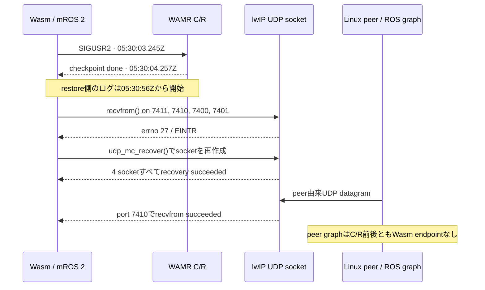
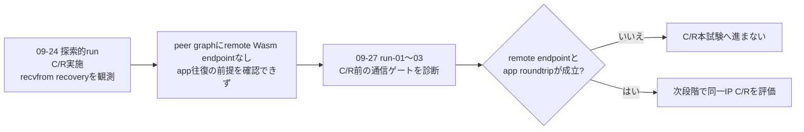

# 2026-09-24 探索的 C/R 実験

**結論:** この実験ではWasmのcheckpointとrestoreを実行し、restore後にUDP `recvfrom()` が `EINTR`（errno 27）で失敗した後、mROS 2/lwIPの `udp_mc_recover()` が4つのsocketを作り直したログを確認した。ただし、peerのROS graphにWasm endpointはC/R前後とも現れていない。peer側からのアプリデータ送信も動いておらず、pub/subの往復が復旧した実験とは判定できない。

この記録は、/tmpに置かれていた当時のログから主要な生ログをGit管理下へコピーして整理したもの。対象は調査メモが指す2026-09-24の探索的runであり、2026-09-27のrun-01〜03とは別の実行である。

## 観測した順序

| 観測 | ログに残る事実 | そこから言える範囲 |
|---|---|---|
| Checkpoint | `SIGUSR2` 05:30:03.245Z、`checkpoint done:0` 05:30:04.257Z | checkpoint処理が完了した |
| Restore | `final-wasm.log`は05:30:56Zに起動し、WAMRのthread restore記録を含む | restore側の実行が始まった |
| UDP受信 | 7411・7410で05:30:57.946Z、7400・7401で05:30:58.948Zに`errno=27` | restore後の待受けが割込みエラーを返した |
| socket recovery | `udp_mc_recover succeeded`。fdは7411 `5→30`、7410 `11→12`、7400 `13→6`、7401 `3→11` | アプリ側の復旧処理がsocketを再作成できた |
| recovery後の受信 | 05:30:58.948Z、作り直したport 7410 / fd 12で`peer=ac120005`の`recvfrom succeeded`記録あり | peer由来UDP datagramの受信記録がある。ROS app callbackやpub/sub完了の証拠ではない |
| peer graph | [`precr-topics.log`](raw/precr-topics.log)と[`postcr-topics.log`](raw/postcr-topics.log)で、peer自身のendpointだけ | Wasm endpointの発見・再登録は確認できない |

当時のアプリログには`publishing msg`が出ているが、これはpublish呼び出しの記録で、相手が受信した証拠ではない。研究メモの会話記録では、native peer側のapp-data送信はこのrunで動作しておらず、送信側packet captureも意図的に取っていないと確認されている。

## socket journalについて

このログ束はcheckpoint/restoreとrestore後のsocket recoveryを示す。一方、ここに保存された記録だけでは、socket journalのdumpとreplayそれぞれがどのfd・membershipをどう復元したかを独立に追えない。したがって「socket journal replayだけで通信が復旧した」とは結論しない。確認できたのは、restore後の`recvfrom()`失敗をmROS 2/lwIP側のrecovery処理が受け取り、UDP socketを再作成し、その後に受信ログが出たところまでである。

## 2026-09-27のrunとの関係

よって、run-03は「この研究で初めてC/Rを試すrun」ではない。以前の探索的runでC/R後のUDP socket回復らしい挙動は記録されたが、C/R前からROS endpointの対応付けとアプリ通信を確認できていなかった。run-01〜03はその不足を埋め、C/R結果を通信復旧として解釈できる前提があるかを診断している。run-03の結果は[こちら](../../../2026-09-27/runs/run-03/report.md)。

## 生ログ

- [`cr-boundary.log`](raw/cr-boundary.log): checkpointと`recvfrom`／recovery境界の抽出記録
- [`precr-wasm.log`](raw/precr-wasm.log): checkpoint前のWasmログ
- [`final-wasm.log`](raw/final-wasm.log): restore側から後続動作までのWasmログ
- [`precr-topics.log`](raw/precr-topics.log)、[`postcr-topics.log`](raw/postcr-topics.log)、[`final-topics.log`](raw/final-topics.log): peer側topic endpoint snapshot

出典ディレクトリは`/tmp/mros2-cr-debug.Q6Mu3y/`。ログ以外のbuild出力とcheckpoint artifactはここへ複製していない。source worktreeの記録は、root revision `21c711f`、branch `debug/recvfrom-observability`（submoduleに意図した未commit変更あり）。
