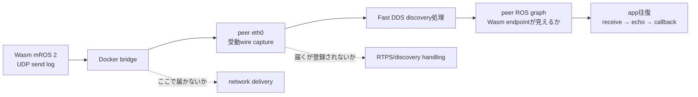
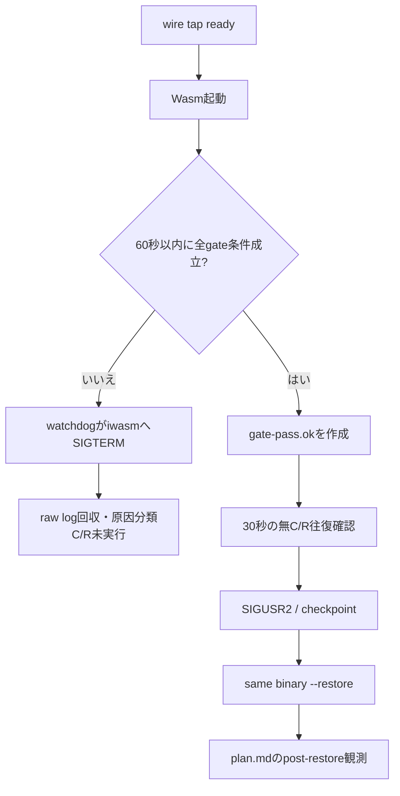

# run-02 計画: discovery packet境界の確認とC/R前ゲート再試行

**結論:** run-01はC/R前ゲートで止まった。次は条件を変えずに、Wasmが送るRTPS multicastがpeerのnetwork interfaceまで届くかを受動captureし、届いた後にROS graphへ登録されるかを切り分ける。60秒ゲートを通過した場合だけ、承認済み[`plan.md`](plan.md)の無C/R・checkpoint・restoreへ進む。

Sol review: **APPROVE**（2026-09-27）。gate evidenceをpeer graph上のremote endpoint GID/countとmessage IDの往復に明確化した版。

## 1. run-01で確認した境界

- Wasmは `/to_linux` の`publish()`を呼び、`publish_return`を記録した。
- peer graphの558 snapshotsすべてで、Wasm publisher/subscriberはpeer側に現れなかった。
- peerの受信とecho、およびWasm app callbackは0件だった。
- Wasmログにはpeer発RTPS DATAのReader配送記録があったが、これだけではapp messageの往復を示さない。
- Wasmログ上、UDP送信先に`239.255.0.1:7400`が記録される。一方、peer interfaceでそのframeを観測した証拠はまだない。

以上から、まだ分からないのは「Wasmから出たRTPS discovery packetがbridgeを越えてpeerに届かない」のか、「peerまで届くがFast DDSがparticipant／endpointとして登録しない」のかである。どちらかをrun-01のログだけから断定しない。

### 図1: 追加で見る境界



## 2. run-01と同じにする条件

| 条件 | 固定値 |
|---|---|
| Docker network | 同じ`mros2-cr-net`、ID `609362e37c7a945ba44d7f2416fe24159ed9d9adb36207f8eb844b95b3c37408`、`172.18.0.0/16`、gateway `.1`、`Internal=false`。作り直さず設定を変えない |
| IP | WAMR `.3`、ROS peer `.5` |
| image / ROS | 同じ`ros:humble` image ID `sha256:1813d3c85d7f96ff7d3012d865204583255740182db5d0065f8f8cd029a83138`、ROS_DOMAIN_ID 0、Fast DDS RMW |
| repository / submodule commits | root `0842ac9782cf51c5806619c2c3af9e1467435727`、mROS 2 `a8d4481c4531f77b143d5e78ac32b333c338b0a2`、embeddedRTPS `81a6a4fe9309f3cb16f0f3b60c92ca89b8602182`、lwip-wasm `5acfdb028b8d1b8ddf158671eeb7e539901ac11a`、WAMR `2dd4eae0f301dd100e651c037ce6a3a8f56cce5e` |
| runtime/Wasm | run-01と同じ計測binary。iwasm SHA-256 `96c9f1ae89a29e8b2ab87eccdb54df4f7e6203be6945413cc19052df09f3920a`、Wasm SHA-256 `0a725f9a303650a64358964a6f6ef0cd84d5cc82734fcbeb87ec8f7dd1d8df76`。run-01 metadataと照合し、再buildしない |
| application endpoints | peerの`/to_linux` subscriberと`/to_stm` publisher、Wasmの同じpublisher/subscriber |
| type / QoS | `std_msgs/msg/String`、両方向BEST_EFFORT・VOLATILE |
| timing gate | Wasm起動後60秒。endpointと10個の異なるIDの往復が全て揃った場合だけC/Rへ進む |
| checkpoint image | 新しい空の`/tmp/mros2-wasm-cr-rerun-20260927/state-run-02`。run-01のstate pathは再利用しない |

追加するのは、peer container内の受動packet observerとhost側deadline watchdogだけ。network設定、route、multicast設定、ROS domain、publisher/subscriberは変更しない。observerはAF_PACKETで`eth0`を読むだけで、promiscuous modeを有効にせず、packetを送信せず、UDP portへbindせず、multicast groupへjoinせず、ROS nodeも作らない。出力はIP/UDP headerとRTPS header・submessage/entity IDのみで、user payloadは保存しない。

## 3. 起動前チェック

1. run-01のreportとmetadataを変更せず残す。run-02のraw directoryと新しいstate directoryを空で用意する。
2. 同じnetwork ID/options、同じimage ID、`.3`/`.5`の割当、WAMRとpeerだけがnetworkへ接続していることを保存する。
3. peer containerにはrun directoryを`/experiment` read-only、同じrunの`raw/`を`/capture` read-writeで別々にmountする。これによりscriptは変更不可、生ログだけhostのGit管理下へ書き込める。
4. peer graph baselineを最低3回、1秒間隔で保存する。`/to_linux`にはpeer subscriberだけ、`/to_stm`にはpeer publisherだけがいることを確認する。
5. peer container内で[`runs/run-02/rtps_wire_tap.py`](runs/run-02/rtps_wire_tap.py)を起動し、`capture_ready`が`raw/peer-wire.jsonl`へ記録されたことを確認する。既定container capabilityでAF_PACKET socketが使えなければ、capabilityを追加せずWasmを起動する前に中止する。
6. observer起動後にもpeer graph baselineを再確認する。endpoint数やGIDが変わった場合は中止する。

起動時は以下のmountを使う。`${RUN_DIR}`はrun-02の絶対path、`${RAW_DIR}`は`${RUN_DIR}/raw`、`${REPO}`とartifact pathはplan.md A節の同一絶対path。

```bash
rtk docker run -d --name mros2-cr-run02-peer --pull=never \
  --network mros2-cr-net --ip 172.18.0.5 \
  -e ROS_DOMAIN_ID=0 -e ROS_LOCALHOST_ONLY=0 \
  -e RMW_IMPLEMENTATION=rmw_fastrtps_cpp \
  --mount type=bind,src="${RUN_DIR}",dst=/experiment,readonly \
  --mount type=bind,src="${RAW_DIR}",dst=/capture \
  ros:humble bash -lc \
  'source /opt/ros/humble/setup.bash && exec python3 /experiment/echo_peer.py'

rtk docker run -d --name mros2-cr-run02-wamr --pull=never \
  --network mros2-cr-net --ip 172.18.0.3 \
  --mount type=bind,src="${REPO}",dst=/repo,readonly \
  --mount type=bind,src="${RUN_DIR}",dst=/run \
  --mount type=bind,src="${RUNTIME_DIR}",dst=/runtime,readonly \
  --mount type=bind,src="${APP_DIR}",dst=/artifact,readonly \
  --mount type=bind,src="${STATE_DIR}",dst=/state \
  --workdir /state ros:humble sleep infinity
```

peer graph helperはrun-01と同じendpoint/QoS/message動作を使う。変更は、ROS shutdown済みの場合に`rclpy.shutdown()`を再度呼ばないcleanup guardだけ。

observerは同じpeer container内の別processとし、stdout/stderrもrawへ回収する。PIDはshell `exec`でPythonと同一になる。

```bash
rtk docker exec -d mros2-cr-run02-peer sh -c \
  'printf "%s\\n" "$$" > /capture/peer-wire.pid; exec python3 /experiment/rtps_wire_tap.py /capture/peer-wire.jsonl >> /capture/wire-tap.stdout.log 2>&1'
```

`peer-wire.pid`のprocess argvが`python3 /experiment/rtps_wire_tap.py /capture/peer-wire.jsonl`であることを`ps`で確認し、stdoutに`capture_ready`が出るまでWasmを起動しない。終了時は同じPIDのargvを再確認し、そのPIDへSIGTERMを送る。

```bash
rtk docker exec mros2-cr-run02-peer sh -c \
  'p=$(cat /capture/peer-wire.pid); a=$(ps -p "$p" -o args=); case "$a" in *"/experiment/rtps_wire_tap.py /capture/peer-wire.jsonl"*) kill -TERM "$p" ;; *) exit 42 ;; esac'
```

その後、`ps -p PID -o args=`が空であること、`raw/peer-wire.jsonl`の最後に`capture_stop`があることを確認する。raw directoryがbind mountされているため、`peer-wire.jsonl`と`wire-tap.stdout.log`はcontainerを削除してもhost側に残る。peerの通常ROS logも`rtk proxy docker logs --timestamps mros2-cr-run02-peer > raw/ros-peer-run-02.log`で保存する。

## 4. 60秒ゲートとdeadline停止

1. 別process/sessionで[`runs/run-02/gate_watchdog.py`](runs/run-02/gate_watchdog.py)を先に開始する。watchdogはcollectorの`process_verified`行を待つ。
2. watchdogの起動記録を確認後、別process/sessionで[`runs/run-02/run_wasm_phase.py`](runs/run-02/run_wasm_phase.py)を起動する。collectorはWAMR stdout/stderrを既に`raw/wasm-checkpoint.log`に保存するため、重複したterminal streamは`/dev/null`へ送る。

```bash
# Session A: 起動してwatchdog_startを確認、そこで待機
rtk python3 "${RUN_DIR}/gate_watchdog.py" mros2-cr-run02-wamr
# Session B: Aの起動後に開始。collectorのraw logは自動保存する
rtk python3 "${RUN_DIR}/run_wasm_phase.py" checkpoint mros2-cr-run02-wamr > /dev/null 2>&1
```

watchdogは`process_verified`行の`host_mono_ns`を読み、**その記録時刻から**60秒のdeadlineを計算する。watchdogが行を読み取った時刻からの60秒ではない。
3. gate passを示す`raw/gate-pass.ok`は、全条件を満たした時にだけ作る。markerには作成時の`time.monotonic_ns()`を`gate_pass_host_mono_ns`として保存する。watchdogはその値が`process_verified`時刻以降かつdeadline以前の場合だけgate passを受理する。起動前に存在したmarkerではwatchdogが拒否をraw log/statusへ記録し、deadline後のmarkerは無視してiwasmを停止する。
4. deadline時点でgate pass markerがない場合、watchdogはPID fileを読み`ps`でcheckpoint argv全体を確認し、対象iwasmへSIGTERMを送る。4秒以内に終了すれば終了を記録する。残っている場合は同じPIDのargvを再確認してからSIGKILLし、さらに4秒で終了を確認する。Docker/`ps`の確認に失敗する、PIDが不正、またはSIGKILL後にも残る場合は、最後のfail-closed手段としてrun-specific `mros2-cr-run02-wamr` containerだけをstopする。各段階と終了codeをwatchdog log/statusに残す。
5. gate passは以下を全て満たす場合だけ記録する。
   - peer graphで`/to_linux`のWasm publisherとpeer subscriber、`/to_stm`のpeer publisherとWasm subscriberのGID・countが各1つ確認できる。これを両方向のdiscovery/matchの記録とする。現在のWasm計測binaryに明示的なremote endpoint matchログはないため、そのログ文字列は条件にしない。
   - peer graph endpoint countが1秒間隔で連続3回安定し、unexpected GIDがない。
   - 少なくとも10個の異なるIDについて`Wasm publish → peer_receive → peer_echo → Wasm callback`が対応する。
   - network、IP、binary hashに変化がない。
6. gate pass後は`gate-pass.ok`を書いた直後に、承認済み`plan.md`の30秒無C/R観測とcheckpoint手順へ進む。gate不通過ならwatchdogに停止させ、SIGUSR2／restoreは行わない。

markerはrun-02の作業directoryから次の形で一度だけ作る。`round_trip_ids`には確認済みの異なる10 ID以上を記録し、`graph_snapshot_utc`には直近の安定snapshot時刻を書く。`open("x")`は同名markerの上書きを拒否する。

```bash
rtk python3 -c 'import datetime,time; from pathlib import Path; p=Path("experiments/socket-journal-cr/2026-09-27/runs/run-02/raw/gate-pass.ok"); p.open("x").write(f"gate_pass_host_mono_ns={time.monotonic_ns()}\ngate_pass_utc={datetime.datetime.now(datetime.timezone.utc).isoformat()}\nround_trip_ids=...\ngraph_snapshot_utc=...\n")'
```

### 図2: gate判定と実行経路



## 5. packet logの読み方

`peer-wire.jsonl`はUDP source/destination IP・port、UDP payload length、RTPS magic、GUID prefix、submessage ID、DATA submessageのreader/writer entity IDを記録する。user payload bytesは保存しない。

- Wasm送信記録はあるがpeer `eth0`に`.3 → 239.255.0.1:7400`がない: peerまで届く前のnetwork deliveryを調べる。
- peer `eth0`にWasm由来RTPS frameがあるがpeer graphにWasm endpointがない: 受信RTPS packetとdiscovery処理／endpoint登録の境界を調べる。
- graph・10往復が揃う: 初めてC/R実験へ進む。

これは原因を分類する観測であり、packetの有無だけからsocket journalやC/Rの正しさを結論しない。

## 6. 成果物とcleanup

- `runs/run-02/raw/`にWasm collector、peer graph/message log、`peer-wire.jsonl`、watchdog log/status、container/network inspect、route、hashを保存する。
- `state-run-02`、run-01 state、build artifactsを混ぜない。
- peer packet observerをSIGTERMで止めて`capture_stop`を記録する。raw log回収後、run-02で起動したpeer/WAMR containerだけを停止・削除する。
- 結果をrun-02の`report.md`に結論先行でまとめ、gateが失敗した場合はC/R失敗と呼ばない。
