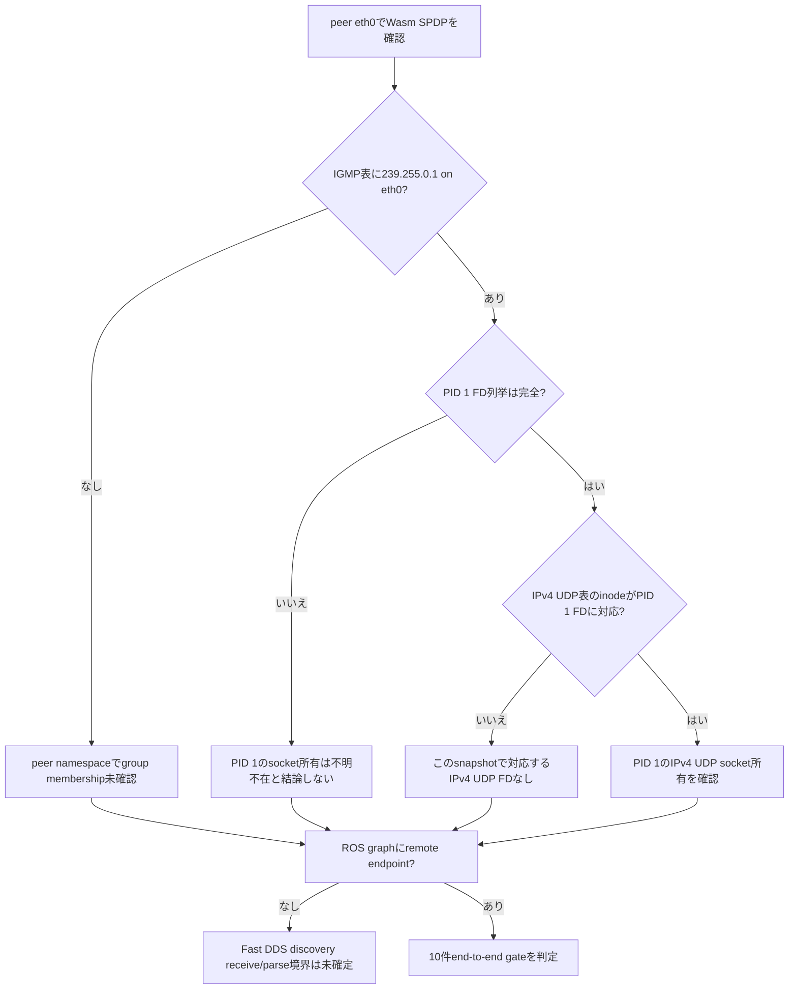

# run-03 計画: peer multicast受信状態の読み取り

**結論:** run-02ではWasmのSPDP frameがpeer `eth0`で観測されたが、peer ROS graphにWasm endpointが出なかった。run-03ではnetwork・IP・image・Wasm binary・ROS endpointをそのまま保ち、peer network namespaceのIGMP membershipとUDP socket状態を1秒間隔で読み取る。60秒の同じendpoint／message gateを通った場合だけ、既承認の同一IP C/R手順へ進む。

Sol re-review: **APPROVE**（2026-09-27）。`/proc`原文、udp6未解析の扱い、FD列挙エラーとsnapshot不完全時の判定を確認済み。

## 1. run-02から引き継ぐ観測

- peer `eth0`の受動AF_PACKET captureに`.3 → 239.255.0.1:7400`のWasm SPDP builtin participant writer `000100c2`が62 frame記録された。
- peer ROS graphは274 snapshotsすべてpeer自身のendpointだけで、remote Wasm endpointは0。peer receive/echoとWasm callbackも0。
- よってframe到達後の次の未観測境界は、peer network namespaceのmulticast membership／UDP socketとFast DDS discovery処理。
- run-02 report: [`runs/run-02/report.md`](runs/run-02/report.md)

### 図1: 今回追加する読み取り境界

```mermaid
flowchart LR
    W[Wasm SPDP .3] -->|RTPS multicast| E[peer eth0]
    E -->|既存AF_PACKET tap| P[frame header]
    E -->|kernel network namespace| I[/proc/net/igmp<br/>group membership]
    I --> U[/proc/net/udp + /proc/1/fd<br/>socket inode / PID 1 FD]
    U -. 読み取りのみ .-> F[Fast DDS discovery]
    F --> G[peer ROS graph]
```

proc probeが示すのはnamespace内のIGMP group一覧とUDP socket table、ROS peer PID 1が持つsocket inode/FDの対応まで。IGMP表はjoinを個別socketやprocessへ対応づけないため、同じUDP socketがそのgroupにjoinしたことや、Fast DDSがpayloadを処理したことまでは証明しない。

## 2. 固定条件

run-02と同じrun parametersを再確認し、差分があればWasmを起動しない。

| 条件 | 固定値 |
|---|---|
| network | 既存`mros2-cr-net`、ID `609362e37c7a945ba44d7f2416fe24159ed9d9adb36207f8eb844b95b3c37408`、`172.18.0.0/16`、gateway `.1`。再作成・設定変更なし |
| IP | WAMR `.3`、ROS peer `.5` |
| ROS image | `ros:humble`, image ID `sha256:1813d3c85d7f96ff7d3012d865204583255740182db5d0065f8f8cd029a83138` |
| Wasm/runtime | run-02と同じartifact、再buildなし。iwasm `96c9f1ae89a29e8b2ab87eccdb54df4f7e6203be6945413cc19052df09f3920a`、Wasm `0a725f9a303650a64358964a6f6ef0cd84d5cc82734fcbeb87ec8f7dd1d8df76` |
| ROS graph/app | `ROS_DOMAIN_ID=0`, Fast DDS, `/to_linux` subscriber / `/to_stm` publisher、`std_msgs/msg/String`, BEST_EFFORT / VOLATILE |
| state | 新しい空の`/tmp/mros2-wasm-cr-rerun-20260927/state-run-03`。run-01/02 state再利用なし |
| gate | `process_verified`から60秒以内に両remote endpoint GID、安定3 graph snapshots、10 distinct full roundtrips |

run-03で追加するのはpeer `eth0`のAF_PACKET observerと、`/proc/net/igmp`・`/proc/net/udp`・`/proc/net/udp6`・`/proc/1/fd`を読むsidecarだけ。probeはsocketをopen/bindせず、multicast joinせず、packetを送らず、ROS nodeを作らない。networkのmulticast設定やpeer/Wasm挙動は変更しない。

## 3. 起動前チェックとprobe

1. run-01/02のraw evidenceと比較し、同じnetwork/image/artifact hash、`.3`/`.5`が空いていることを記録する。networkに実験container以外のattachmentがある場合は開始しない。
2. `state-run-03`が存在しないことを確認し、新規作成する。run-03の`raw/`が空であることも確認する。
3. run-02と同じpeer/WAMR container構成をrun-03名で起動する。peer `/experiment`はread-only、`/capture`はrun-03のraw directoryへread-write mount。WAMR `/repo`・`/runtime`・`/artifact`はread-only、`/run`・`/state`はread-write。
4. peer graph baselineを3回以上、1秒間隔で記録する。peer自身の`/to_linux` subscriberと`/to_stm` publisher以外が見えたら中止する。
5. peer container内で`rtps_wire_tap.py`と[`udp_socket_probe.py`](runs/run-03/udp_socket_probe.py)を別processとして起動する。各PIDのargvを`ps`で確認し、`capture_ready`／`probe_ready`がraw stdout/jsonlに記録されたことを確認する。
6. probeの事前snapshotで`eth0`、IGMP group、UDP table、PID 1 FD inode mapが読めることを確認する。各snapshotには`/proc/net/igmp`、`/proc/net/udp`、`/proc/net/udp6`の原文をそれぞれ`igmp_table_raw`、`udp_table_raw`、`udp6_table_raw_unparsed`として保存する。`udp6`は解析しない。IPv4 UDP表だけをsocket一覧に構造化し、FD対応には`pid1_fd_ownership_known`を添える。原文の読取error、FD directory error、unreadable FD symlink、または列挙中に消えたFDがあれば事前snapshotを不完全とし、Wasmを起動せずrunを中止する。`pid1_fd_ownership_known=false`の`pid1_fds: []`は「PID 1にsocketがない」根拠として扱わない。
7. observer/probe追加後にROS graph baselineを再確認する。状態が変化した場合は中止する。

### 図2: run-03の起動順

```mermaid
sequenceDiagram
    participant P as ROS peer
    participant T as AF_PACKET tap
    participant S as proc socket probe
    participant W as WAMR runner
    participant G as watchdog
    P->>P: local-only graph baseline
    T->>P: capture_ready
    S->>P: probe_ready + first proc snapshot
    G->>W: start watchdog; wait process_verified
    W->>W: launch collector/iwasm
    Note over G,W: gate window = 60 s from process_verified
```

Peer start command uses the same image/env as run-02, with these run-specific mounts:

```bash
rtk docker run -d --name mros2-cr-run03-peer --pull=never \
  --network mros2-cr-net --ip 172.18.0.5 \
  -e ROS_DOMAIN_ID=0 -e ROS_LOCALHOST_ONLY=0 \
  -e RMW_IMPLEMENTATION=rmw_fastrtps_cpp \
  --mount type=bind,src="${RUN_DIR}",dst=/experiment,readonly \
  --mount type=bind,src="${RAW_DIR}",dst=/capture \
  ros:humble bash -lc \
  'source /opt/ros/humble/setup.bash && exec python3 /experiment/echo_peer.py'
```

Start AF_PACKET capture as specified in `plan-run-02.md`, using the run-03 peer name and `/experiment/rtps_wire_tap.py`. Start proc probe in a second process; its output paths must be `/capture/peer-socket-state.jsonl` and `/capture/socket-probe.stdout.log`:

```bash
rtk docker exec -d mros2-cr-run03-peer sh -c \
  'printf "%s\\n" "$$" > /capture/socket-probe.pid; exec python3 /experiment/udp_socket_probe.py /capture/peer-socket-state.jsonl >> /capture/socket-probe.stdout.log 2>&1'
```

The WAMR runner uses the run-02 mounts and argv with container name `mros2-cr-run03-wamr`, run directory `runs/run-03`, and state directory `/tmp/mros2-wasm-cr-rerun-20260927/state-run-03`. Save full `docker inspect`, network inspect, route, exact command, and hashes under `runs/run-03/raw/`.

## 4. 60秒ゲート

1. `gate_watchdog.py mros2-cr-run03-wamr`をcollectorより先に起動する。watchdogはcollector logの`process_verified.host_mono_ns`に60秒を足してdeadlineを固定する。
2. watchdog startを記録した後、`run_wasm_phase.py checkpoint mros2-cr-run03-wamr`を別sessionで起動する。
3. gate pass markerは全条件成立後だけ`open("x")`で一度だけ作る。起動前marker、期限後marker、またはPID argv不一致を受理しない。
4. gate pass条件:
   - peer graphで`/to_linux`のremote Wasm publisherとlocal peer subscriber、`/to_stm`のlocal peer publisherとremote Wasm subscriberのGID/countが各1。
   - endpoint countsと期待GIDが1秒間隔の連続3 snapshotで安定し、unexpected GIDがない。
   - 少なくとも10個のdistinct IDで`Wasm publish → peer_receive → peer_echo → Wasm callback`が対応する。
   - network、IP、image、runtime/Wasm hashに差がない。
5. 60秒で未達ならwatchdogに正確なiwasm PIDを停止させる。SIGUSR2・restore・journal dump/replayは行わず、proc snapshotとwire captureを併せて原因境界を記録する。実行中のsnapshotで表の読取errorやFD列挙不完全が出た場合、そのsnapshotのPID 1 socket所有関係はunknownと記録し、空の`pid1_fds`からsocket不在を推定しない。
6. gate passの場合は`gate-pass.ok`を書いたあと、[`plan.md`](plan.md)の30秒no-C/R区間と同一IP C/Rを続ける。ただしcontainer名・run/raw path・state path・tagはrun-03用へ置換する。peerは保持し、checkpointとrestoreに同じ`.3` runnerと同一binary hashを使う。

### 図3: proc snapshotの読み分け



このprobeはsocketごとのmulticast membershipを示さない。FD列挙が不完全なsnapshotではPID 1のsocket所有関係を不明とし、UDP表の`pid1_fds`が空でもsocket不在と結論しない。`udp6_table_raw_unparsed`は保存だけで解析しないため、IPv4の`udp_sockets`からPID 1のIPv6 UDP socketの有無を推定しない。`IGMP groupあり + PID 1のIPv4 UDP socketあり`でもFast DDSがSPDP payloadを受け取った／処理したとは結論しない。

## 5. 保存・cleanup

- peer ROS log、peer graph snapshots、wire capture、proc JSONL/stdout、watchdog log/status、Wasm collector/status、container/network inspect、route、artifact hashesをrun-03のGit管理`raw/`へ保存する。
- gate後、PIDとargvを照合してwire tapとproc probeへSIGTERMを送る。両方に`capture_stop`／`probe_stop`が記録された後、peer/WAMR logsとinspectを回収する。
- run-03で起動した`mros2-cr-run03-peer`と`mros2-cr-run03-wamr`だけを停止・削除する。`mros2-cr-net`と他のnetwork/containerは変更しない。
- 結果は`runs/run-03/report.md`に結論先行で記録する。C/R前gate不通過をC/R失敗と呼ばない。
