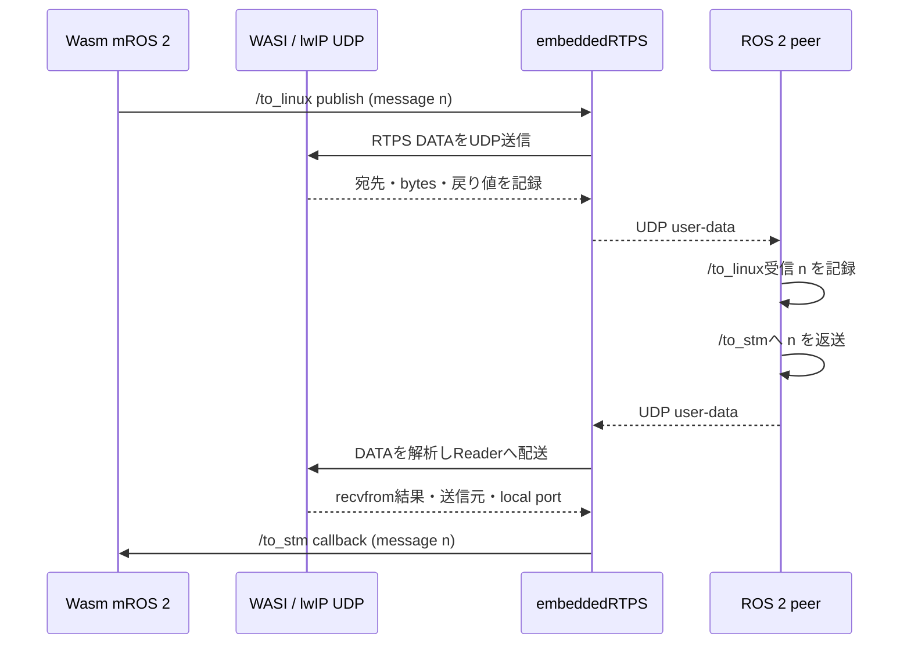
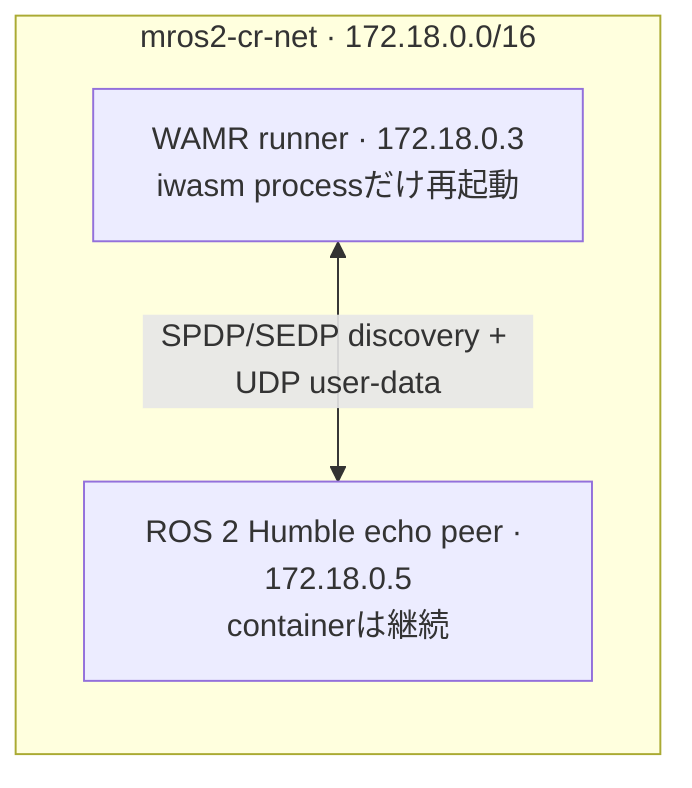
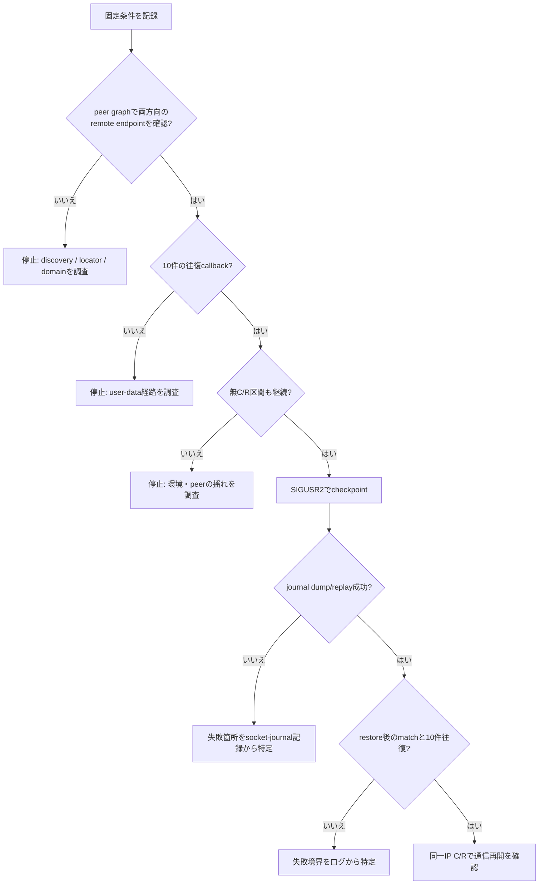

# Socket Journal を使った mROS 2 Wasm C/R 再実験計画

**結論:** C/Rを始める条件を「直前に両方向のendpointが一致し、メッセージの往復が実際に確認できたこと」とする。同じWasm・WAMR・peer・ネットワーク条件を保ったまま、まず無C/R区間を記録し、その後に同一IPで1回C/Rする。開始ゲートに通らなければC/Rは行わない。

**ゲート証拠の補足（2026-09-27、run-01後に明確化）:** 現在のWasm計測binaryには、remote publisher/subscriberのmatchを直接示すログがない。このため、matchの判定はpeer ROS graphが示すremote endpointのGID/countと、同じmessage IDの両方向往復で行う。Wasm側の明示的なmatchログ文字列は必須にしない。run-01の結果は実行時点の記録どおり扱い、この明確化で変更しない。

この計画は、2026-09-24のログを「通信復旧実験」として扱い直さないためのものでもある。同日の実行ではC/R前からWasm側endpointがpeerに見えておらず、pub/subの前提を満たしていなかった。今回のログでは、準備状態・checkpoint・socket journal replay・RTPS通信・アプリcallbackを別々に観測する。

## 1. 調べること

### 主な問い

**同じIP・同じpeerでC/R直前のpub/sub往復を確認したWasm mROS 2 nodeは、socket journalを含むC/R後に新しいメッセージの往復を再開できるか。**

この1回の実験で、別ホスト移行、IP変更時の移行、`recvfrom()` のerrnoの原因までは結論しない。SIGUSR2の直後にEINTRが出た場合も、時刻が近いことだけでは因果関係の証明としない。

### 優先して確かめる仮説

1. **最優先: 同一IPなら、checkpointとsocket journal replayの後にpub/subが再開する。** C/R後にpeer graphでremote endpointを確認し、checkpoint前の最大publish番号より大きい番号がpeer往復とWasm callbackまで届けば支持する。止まった場合は最後に通った境界を示す。
2. **次点: 9/24のログでは、C/R前にendpointとアプリ通信が成立していなかったため、復旧可否を判定できなかった。** 今回の事前ゲートを通すことが前提。これは9/24の不成立理由そのものを特定する仮説ではない。
3. **次点: C/Rを挟まない区間では通信が継続し、C/R後にのみ差が現れる。** 30秒の無C/R区間とC/R後の同一構成を比べる。1回の実験なので一般的な再現率は主張しない。

`SIGUSR2`がWASI `EINTR`を直接起こすという仮説は、今回の同一IP復旧実験だけでは因果判定しない。signal/no-signalの独立した対照実験に分ける。

### 記録する観測点

| 段階 | 記録する事実 | それだけでは言えないこと |
|---|---|---|
| 準備 | peer graph上の両方向remote endpoint GID/count、topic・type・domain・QoS | callbackが実際に動いたこと |
| アプリ送信 | Wasmのmessage番号、`publish()` 呼び出し前後 | peerへの到達 |
| UDP送信 | UDP宛先IP/port、長さ、`udp_sendto()` / WASI `sock_send_to` の戻り値 | peerのRTPS Readerが受理したこと |
| RTPS受信 | source、local/remote port、DATA submessage、Reader/Writer ID、sequence number、Reader検索結果 | ROSアプリcallbackが動いたこと |
| peer | 受信したmessage番号と返送した番号 | Wasm callbackが動いたこと |
| Wasm受信 | WAMR/WASIとlwIPのfd、errno、bytes、socket再生成結果 | RTPSとして解析・配送できたこと |
| 復帰 | socket journalのdump/replay件数と各結果、SPDP/SEDPの再発見、peer graph上のremote endpoint GID/count | user-dataが再開したこと |
| 最終結果 | Wasm `/to_stm` callbackが受け取ったmessage番号 | 別IP・別ホストで同様に動くこと |

### 図1: 1つのmessage番号を追う経路



### 図2: C/Rでつなぐ状態

```mermaid
flowchart LR
    A[実行中: UDP socket / PCB / RTPS endpoint] --> B[SIGUSR2]
    B --> C[Wasm threadを停止してcheckpoint]
    C --> D[Wasm memory・stack・global + socket journalを保存]
    D --> E[元のiwasm process終了]
    E --> F[同じcontainerで同じWasmを --restore 起動]
    F --> G[Wasm状態を復元]
    G --> H[socket journalを順にreplay]
    H --> I[threadを再開]
    I --> J[UDP受信・RTPS discovery / endpoint match]
    J --> K[新しいuser-dataがcallbackへ届くか]
```



## 2. 固定する条件

実行の冒頭で以下を `runs/run-01/metadata.md` に実値で記録する。記録できない条件があれば実行を止め、推測値で埋めない。

| 条件 | 固定値・確認方法 |
|---|---|
| root repository | branch `debug/recvfrom-observability`, HEAD `0842ac9782cf51c5806619c2c3af9e1467435727` |
| mROS 2 | submodule `a8d4481c4531f77b143d5e78ac32b333c338b0a2`; embeddedRTPS `81a6a4fe9309f3cb16f0f3b60c92ca89b8602182` |
| lwip-wasm | submodule `5acfdb028b8d1b8ddf158671eeb7e539901ac11a` |
| WAMR | submodule `2dd4eae0f301dd100e651c037ce6a3a8f56cce5e`; classic interpreter + libc-wasi + wasi-threads の既存socket-journal build |
| runtime (計測前のreference) | 既存の`third_party/wamr/product-mini/platforms/linux/build_socket_journal/iwasm`; SHA-256 `fa91868a8450b3e56e15cc5514b35d50a25d3b72650cb9d6ccba9ddc5f1f845e`。このGit管理外build directoryは保持し、実験用runtimeは一時build directoryへ別に作る |
| Wasm app (計測前) | `cmake_build/echoback_string.wasm`; SHA-256 `237a115984c21bccf6dcfe7ad8013d53bdde2bc6ab1533759f9b89ea394d01d0` |
| peer/WAMR image | 両containerともローカル `ros:humble`。同じimage ID/digestを記録 |
| peer | ROS 2 Humble `std_msgs/msg/String` echo node。`/to_linux`を受け、同じ本文を`/to_stm`へ返す。QoSはKEEP_LAST depth 10 / BEST_EFFORT / VOLATILE。mROS 2のuser Writer/Readerは`reliable=false`で作られるため、通信互換性を合わせる。`ROS_DOMAIN_ID=0`、`ROS_LOCALHOST_ONLY=0`、`RMW_IMPLEMENTATION=rmw_fastrtps_cpp` |
| Wasm node | `echoback_string.wasm`。`/to_linux` publisher、`/to_stm` subscriber、domain 0。アプリは1秒周期で連番文字列をpublish |
| network | 既存Docker bridge `mros2-cr-net`、ID `609362e37c7a945ba44d7f2416fe24159ed9d9adb36207f8eb844b95b3c37408`、driver `bridge`、subnet `172.18.0.0/16`、`Internal=false`。WAMR runner `172.18.0.3`、peer `172.18.0.5`。実行直前にoptionsとstatic IPの空きを再確認 |
| container lifecycle | peer containerを`.5`で継続稼働。WAMR runner containerも`.3`で継続稼働し、PID 1は待機状態にする。checkpoint後は同じcontainer内でiwasm processだけ終了し、同じbind mount上のimageを使って`--restore` processを起動する |
| mounts / working directory | repositoryはcontainer内`/repo`でread-only、Git内のrun logは`/run`でread-write、計測用iwasmは`/runtime`、計測用Wasmは`/artifact`へread-only mount、checkpoint image用にhost `/tmp/mros2-wasm-cr-rerun-20260927/state`を`/state`へread-write mountする。このhost pathは実行前に存在しないことを確認して新規作成する。checkpoint/restoreの両processが同じ`/state`をworking directoryにする。binary imageはGitに入れず、path/size/hashをmetadataへ記録する |
| runtime args | `/runtime/iwasm --addr-pool=0.0.0.0/0 --max-threads=32 -v=5 [--restore] /artifact/echoback_string.wasm`。checkpointとrestoreで`--restore`以外は同じ |
| IP / route | 各container内のinterface、IPv4、`ip route`、Wasm側netif検出IPを記録。`include/netif.h`のlwIP netmaskは`255.255.255.0`、Docker bridgeは`/16`であることを記録し、実際に相互通信できるかをゲートで確かめる。C/R前後でIP固定 |
| 実験外の状態 | 該当networkに実験用2 container以外が接続していないこと、同名containerがないことを確認。peer graph上に期待外のendpoint GIDが現れた場合は開始しない |

### 図3: 固定する実験ネットワーク



root以外のcheckoutには既存の変更がある。`/home/osslab/mros2-posix`、`/home/osslab/mros2-posix-worktree`、WAMRの生成build directoryは変更・clean・resetしない。この再実験ではpeerを実験用のROS 2 echo nodeにして、dirtyなnative checkoutを実行条件に含めない。

## 3. 実験手順と開始ゲート

### A0. 計測用build

既存のWAMR `build_socket_journal`（Git管理外・約880MB）と既存root `cmake_build`は変更しない。計測用runtime/Wasmは`/tmp/mros2-wasm-cr-rerun-20260927/`に別buildし、完成した実行artifactのみをread-only mountする。WASMIG sourceは既存build内の取得済みsourceをcopyして使用し、既存directoryをbuild中に書き換えない。

新規に始める場合は一時build rootが存在しないことを確認し、あれば中身を再利用・上書きせず停止する。今回の`run-01`には、最初のWAMR configureが失敗した際に作られた一時rootがすでにある。そのため今回は、失敗ログとcacheを照合する一度限りの再開手順を使う。これは同じrunの途中生成物だけを使う例外であり、条件が1つでも違えば再開せず停止する。

```bash
rtk python3 -c 'from pathlib import Path; p=Path("/tmp/mros2-wasm-cr-rerun-20260927"); expected={"app","runtime","wamr-build","wasmig-src"}; assert p.is_dir() and {x.name for x in p.iterdir()} == expected; assert all(not any((p/n).iterdir()) for n in ("app","runtime")); c=(p/"wamr-build/CMakeCache.txt").read_text(); assert "CMAKE_HOME_DIRECTORY:INTERNAL=/home/osslab/mros2-wasm-service-communication-socket-journal/third_party/wamr/product-mini/platforms/linux" in c; assert "FETCHCONTENT_SOURCE_DIR_WASMIG:PATH=/tmp/mros2-wasm-cr-rerun-20260927/wasmig-src" in c; print("verified: this is run-01 failed-config root; preserve and resume")'
# Do not mkdir, recopy WASMIG, delete the partial build, or overwrite raw/build.log.
# Append the retry's full configure/build output to that existing raw log.

rtk cmake \
  -S /home/osslab/mros2-wasm-service-communication-socket-journal/third_party/wamr/product-mini/platforms/linux \
  -B /tmp/mros2-wasm-cr-rerun-20260927/wamr-build \
  -DCMAKE_BUILD_TYPE=Release \
  -DWAMR_BUILD_TARGET=X86_64 -DWAMR_BUILD_PLATFORM=linux \
  -DWAMR_BUILD_INTERP=1 -DWAMR_BUILD_AOT=0 -DWAMR_BUILD_FAST_INTERP=0 \
  -DWAMR_BUILD_LIBC_BUILTIN=1 -DWAMR_BUILD_LIBC_WASI=1 \
  -DWAMR_BUILD_LIB_PTHREAD=0 -DWAMR_BUILD_LIB_WASI_THREADS=1 \
  -DWAMR_BUILD_REF_TYPES=1 -DWAMR_BUILD_SHARED_MEMORY=1 \
  -DWAMR_BUILD_THREAD_MGR=1 -DENABLE_TESTS=OFF \
  -DFETCHCONTENT_SOURCE_DIR_WASMIG=/tmp/mros2-wasm-cr-rerun-20260927/wasmig-src
rtk cmake --build /tmp/mros2-wasm-cr-rerun-20260927/wamr-build \
  --target iwasm --parallel 4

# mros2.cpp includes templates-service.hpp unconditionally. This app has no
# service endpoints, so supply an empty compile-only header under the temp
# build directory instead of changing the app checkout.
rtk python3 -c 'from pathlib import Path; p=Path("/tmp/mros2-wasm-cr-rerun-20260927/wasm-build/experiment-includes/templates-service.hpp"); p.parent.mkdir(parents=True, exist_ok=True); text="// Intentionally empty: echoback_string defines no service endpoints.\n"; assert not p.exists() or p.read_text() == text; p.write_text(text); print(p)'

rtk cmake \
  -S /home/osslab/mros2-wasm-service-communication-socket-journal \
  -B /tmp/mros2-wasm-cr-rerun-20260927/wasm-build \
  -DCMAKE_APPNAME=echoback_string \
  -DWASI_SDK_PREFIX=/opt/wasi-sdk-21 \
  -DCMAKE_TOOLCHAIN_FILE=/opt/wasi-sdk-21/share/cmake/wasi-sdk-pthread.cmake \
  -DCMAKE_SYSROOT=/home/osslab/wasi-sysroot \
  -DWAMR_ROOT=/home/osslab/mros2-wasm-service-communication-socket-journal/third_party/wamr \
  -DCARTOGRAPHER_ROOT=/home/osslab/mros2-wasm-service-communication-socket-journal/third_party/cartographer \
  -DCARTOGRAPHER_LIBRARY_ROOT=/home/osslab/mros2-wasm-service-communication-socket-journal/third_party/cartographer-library \
  -DZLIB_LIBRARY=/home/osslab/mros2-wasm-service-communication-socket-journal/cmake_build/zlib-wasi/libz.a \
  -DCMAKE_CXX_FLAGS=-I/tmp/mros2-wasm-cr-rerun-20260927/wasm-build/experiment-includes \
  -DCMAKE_EXPORT_COMPILE_COMMANDS=1
rtk cmake --build /tmp/mros2-wasm-cr-rerun-20260927/wasm-build \
  --target MODULE_echoback_string --parallel 4
rtk cp \
  /tmp/mros2-wasm-cr-rerun-20260927/wamr-build/iwasm \
  /tmp/mros2-wasm-cr-rerun-20260927/runtime/iwasm
rtk cp \
  /tmp/mros2-wasm-cr-rerun-20260927/wasm-build/echoback_string.wasm \
  /tmp/mros2-wasm-cr-rerun-20260927/app/echoback_string.wasm
rtk sha256sum \
  /tmp/mros2-wasm-cr-rerun-20260927/runtime/iwasm \
  /tmp/mros2-wasm-cr-rerun-20260927/app/echoback_string.wasm
```

全CMake commandと実際のcache、build出力、copy後のruntime/Wasm hashを`metadata.md`または`raw/build.log`へ保存する。計測差分を含むiwasmとWasmはcheckpoint/restoreで同一artifactを使う。既存root `cmake_build`のCMakeCacheが`echoreply_string`を指すため、root appも別build directoryへ構成する。root CMakeは`add_subdirectory(lwip-wasm)`で変更済みlwIPの`lwip` targetを実験用build directory内に作り、それをWasmへリンクする。このため既存`lwip-wasm/cmake_build`を再build/installしない。特にstandalone projectのinstall先`lwip-wasm/public`は更新せず、古いbuild outputと公開package生成物を保持する。`mros2/src/mros2.cpp`は`templates-service.hpp`を常時includeするが、`echoback_string`はservice endpointを使わず、そのheaderも持たない。この実験では空のheaderを`wasm-build/experiment-includes/`に一時生成してC++ include pathへ加える。アプリcheckoutには追加せず、サービス関連のtemplate実体化も行わない。

現行CMakeではWAMRの`migration.cmake`が外部FetchContent sourceをbinary directory未指定で`add_subdirectory`してconfigure errorになった。修正はWAMR submoduleの共有source treeにある`third_party/wamr/core/iwasm/migration/migration.cmake`へ加えた1行で、`add_subdirectory(${wasmig_SOURCE_DIR} ${wasmig_BINARY_DIR})`とする。**source tree自体は一時コピーではない**。WAMRの既存build outputは別ディレクトリなので変更しない。これはCMakeのbuild-system修正で、runtime behaviorは変更しない。差分と最終source stateをmetadataに記録し、この再実験中に同じWAMR sourceから別buildを並行起動しない。

再開前の確認では、一時rootの子が`app/`、`runtime/`、`wamr-build/`、`wasmig-src/`の4つだけで、`app/`と`runtime/`は空、WAMR cacheのsource pathとFetchContent source pathがこのrunの絶対pathと一致することを確認する。最初のconfigure失敗は`raw/build.log`に残し、以後のconfigure/build出力を同じファイルへ追記する。チェック後は既存の`wasmig-src/`と部分的な`wamr-build/`を再利用する。

### A. 準備・構成確認

1. `runs/run-01/` にpeer node、実行コマンド、metadata、各processのraw logを保存する。image dumpだけは同じ一時`/state` mountへ置く。build出力は既存のWAMR 880MB build directoryを触らず、`/tmp/mros2-wasm-cr-rerun-20260927/`に分離する。
2. `mros2-cr-net` のnetwork ID/driver/options/subnet、既存container、static IP `.3`と`.5`の空きを記録する。network自体は作り直さない。
3. `ros:humble`の同じimage IDを使い、ROS peer containerを`.5`、WAMR runner containerを`.3`で起動する。peerは`source /opt/ros/humble/setup.bash`後に`python3 /experiment/echo_peer.py`を実行する。両containerは実験中維持する。
4. host `/tmp/mros2-wasm-cr-rerun-20260927/state`がまだ存在しないことを確認して空directoryとして作成する。存在していたら再利用・削除せず停止する。
5. WAMR runnerの`/repo` mountはread-only、`/runtime`と`/artifact` mountもread-only、`/run`と`/state` mountはread-writeにする。`/state`をworking directoryにし、初回のiwasmは`--restore`なしで起動する。`execute.bash`は使わない（default appが異なるため）。
6. 実際のrender済み`docker run`/`docker exec` command、mount、environment、container ID、PID、image ID、container内interface/routeをmetadataに保存する。両containerが指定IPを持つこと、Wasm netif検出IPが`.3`であることを確認する。
7. peer nodeからROS graph endpointのtopic名・type・QoS・GID/countを保存する。`/to_linux`ではremote Wasm publisher 1つとlocal peer subscriber 1つ、`/to_stm`ではlocal peer publisher 1つとremote Wasm subscriber 1つを確認する。graph上のreliabilityは両方向ともBEST_EFFORTであることも確認する。rclpyの`count_publishers()` / `count_subscribers()`も各1で、別のアプリendpointがあれば開始しない。

起動形のテンプレートは以下。`REPO`、`RUN_DIR`、`STATE_DIR`、`RUNTIME_DIR`、`APP_DIR`は絶対pathにし、実行値をmetadataへ記録する。WAMR runnerは待機containerとして残し、checkpoint/restoreごとにcollectorから同じcontainerへiwasmを`docker exec`する。

```bash
rtk docker run -d --name mros2-cr-run01-peer \
  --pull=never \
  --network mros2-cr-net --ip 172.18.0.5 \
  -e ROS_DOMAIN_ID=0 -e ROS_LOCALHOST_ONLY=0 \
  -e RMW_IMPLEMENTATION=rmw_fastrtps_cpp \
  --mount type=bind,src="${RUN_DIR}",dst=/experiment,readonly \
  ros:humble bash -lc \
  'source /opt/ros/humble/setup.bash && exec python3 /experiment/echo_peer.py'

rtk docker run -d --name mros2-cr-run01-wamr \
  --pull=never \
  --network mros2-cr-net --ip 172.18.0.3 \
  --mount type=bind,src="${REPO}",dst=/repo,readonly \
  --mount type=bind,src="${RUN_DIR}",dst=/run \
  --mount type=bind,src="${RUNTIME_DIR}",dst=/runtime,readonly \
  --mount type=bind,src="${APP_DIR}",dst=/artifact,readonly \
  --mount type=bind,src="${STATE_DIR}",dst=/state \
  --workdir /state ros:humble sleep infinity

# The tracked collector launches this exact remote command with `docker exec
# --workdir /state ... sh -c`: it writes `$$` to
# `/run/raw/wasm-<phase>.pid`, then `exec`s
# `/runtime/iwasm --addr-pool=0.0.0.0/0 --max-threads=32 -v=5 [--restore]
# /artifact/echoback_string.wasm`. Before launch it clears that
# phase's old PID/status file, waits for the new PID file, and verifies
# `ps -p PID -o args=` contains the expected runtime, app, and restore flag.
# It records the in-container PID, captures stdout/stderr with host UTC and
# monotonic timestamps, with each line tagged `[CR-RERUN-20260927]` plus
# phase and container PID, then writes docker-exec's exit status to
# `/run/raw/wasm-<phase>.status`. `run_wasm_phase.py` also writes the
# corresponding host PID and exit status beside the raw host log. Start it in
# a long-running shell/session; use a second shell to check the gate and send
# SIGUSR2. `phase` is `checkpoint` or `restore`.
rtk python3 "${RUN_DIR}/run_wasm_phase.py" checkpoint mros2-cr-run01-wamr

# After the pre-C/R gate, signal only the iwasm PID in the WAMR container.
rtk docker exec mros2-cr-run01-wamr sh -c \
  'kill -USR2 "$(cat /run/raw/wasm-checkpoint.pid)"'

# Once the checkpoint phase exits, run the same collector and argv with
# `--restore` added; the runner and peer containers remain up at .3 and .5.
# This stays attached while post-restore samples are collected.
rtk python3 "${RUN_DIR}/run_wasm_phase.py" restore mros2-cr-run01-wamr

# In a second shell, after 10 qualifying callbacks or the 90-second deadline:
rtk docker exec mros2-cr-run01-wamr sh -c \
  'kill -TERM "$(cat /run/raw/wasm-restore.pid)"'

# Stop the two named containers after the post-restore observation, preserve
# their Docker logs, then remove only these run-specific containers.
rtk docker stop mros2-cr-run01-peer mros2-cr-run01-wamr
rtk proxy docker logs --timestamps mros2-cr-run01-peer > \
  "${RUN_DIR}/raw/ros-peer.log"
rtk docker rm mros2-cr-run01-peer mros2-cr-run01-wamr
```

peer nodeは起動時にrole・container PIDを出し、rclpy graph APIでendpoint count/GIDを定期的に調べ、message受信/返送と一緒にstdoutへ出す。graph照会用のros2cli processは起動せず、peer node自身とWasm以外のアプリendpointを作らない。開始時にDocker networkへ接続したcontainerがこの2つだけであることも確認する。`docker logs --timestamps`のUTC prefixでWasm collectorのUTC/monotonic timestampと対応づける。before/after graphファイルはpeerの同じraw logから該当時刻のsnapshotを抜き出して作る。restore後の観測を終えたら、成功数を確定した後にcollector側のrestore PIDへ`SIGTERM`を送り、cleanup signal/exit statusを記録する。raw logをすべて回収してから、上記2 containerだけを停止・削除する。

### B. C/R前の必須ゲート

Wasm起動から**60秒以内**に次をすべて満たした場合にのみC/Rへ進む。

- ROS peerが`/to_linux`のsubscription countと`/to_stm`のpublisher countをそれぞれ1以上と報告する。
- peer graph APIが期待する各topicのlocal endpointとremote Wasm endpointのGIDを1つずつ報告する。これを両方向のdiscovery/matchの記録とする。
- 少なくとも10個の異なるmessage番号について、`Wasm publish → peer receive → peer echo → Wasm callback` がログで対応づく。
- ROS peer endpoint countsが連続3回（1秒間隔）とも1以上で、予期しないendpoint GIDがない。
- 最後に成功したmessage番号、最大`publish()`開始番号、endpoint counts、Wasm/peer IP、実行binaryのhashをmetadataに記録する。
- 上記を連続して確認している間に予期しないendpoint GIDやネットワーク変更を検出していない。Docker networkに接続するcontainerが増えた場合も開始しない。

いずれかが満たされない場合は、ここで停止する。C/Rは実行せず、不一致の段階だけを調べて修正し、同じゲートを最初からやり直す。これにより、9/24のようにendpointが見えていない状態をC/R復旧の失敗と誤認しない。

### C. 同一process内の無C/R観測

ゲート通過後、同じ構成のまま**30秒間**通信を続け、少なくとも10個の新しいmessageが継続して往復することを記録する。ここで途切れた場合はC/Rせず停止する。これはC/Rがないときの通信状態を示す基準区間であり、SIGUSR2単独の因果対照ではない。基準区間の最後にpeer endpoint countsとWasm callbackを再確認する。

### D. 同一IPでC/R

1. 無C/R区間の最後のcallbackから2秒以内に、peer endpoint counts、peer graph上の両方向remote GID、Wasm/peer IP、最後のcallback IDを再確認する。不一致ならC/Rせず停止する。
2. その時点までの最大`publish()`開始番号を`N`として記録し、WAMR runner内のiwasm PIDへ`SIGUSR2`を送る。signal時刻とPIDを記録する。
3. **30秒以内**にcheckpoint完了とiwasm process終了を確認する。dump logが報告する実際のjournal pathを使う。threaded buildではpathが`${file_prefix}socket.img`となり、main threadのprefixは`main-`なので、想定pathは`/state/main-socket.img`。実際のpath、存在、size、SHA-256を記録する。journal imageを欠く場合はゲート通過後のC/R機構の失敗として記録する。
4. `wasm_socket_journal.c`がjournal dump/replayの観測ログをprocess stdout/stderrへ出すよう計測する。ログをbinary journal imageへ書き込まない。dump countが0でないこと、overflowがないこと、replay countがdump countと一致すること、unknown op/未回復のreplay errorがないこと、各operationの最終適用結果が成功したことを要求する。`IP_ADD_MEMBERSHIP`の最初の試行が失敗してinterface 0の再試行が成功した場合は成功として数え、fallbackを明記する。現実装は一部エラーでも呼出側に成功を返し得るため、関数returnだけでは判定しない。
5. 同じWAMR runner container `.3`、image、mount、working directory、runtime/Wasm binary、networkで、同じargvに`--restore`だけ加えて起動する。peer container `.5`は止めない。**30秒以内**にrestoreとjournal replayの完了を確認する。
6. restore起動から**60秒以内**にpeer endpoint countsが回復し、peer graphで両方向のremote endpoint GIDを確認できることを記録する。
7. **`N`より大きい異なる10個以上のmessage番号**について、peer受信・peer返送・Wasm callbackが同じ本文番号を示すことをrestoreから**90秒以内**に確認する。`N`以下のin-flight/遅着、重複、欠番も記録し、数えない理由を残す。
8. 観測が終わったら、成功/timeoutの判定後にrestore PIDへ`SIGTERM`を送り、collectorがprocess終了statusとcleanup理由を記録する。これはC/R成否と分けて扱う。

### 図4: 判断ゲート



## 4. 不足ログと追加する計測

既存ログだけでは「送信呼び出し」「UDPへの投入」「RTPS Readerへの配送」「アプリcallback」が分離できない。再実験前に、挙動は変えず、以下の境界へ短い構造化ログを追加する。全行に同じrun tagと時刻を付け、message内容は連番だけ記録する。

| 追加するログ | 主な場所 | 目的 |
|---|---|---|
| `publish()` entry/returnとcallbackのmessage番号 | `workspace/echoback_string/app.cpp` | 既存の`publishing msg`は呼び出し前の表示なので、アプリがAPIを呼んだ範囲とcallbackを区別 |
| journal dump/replay: file path、op index/種類、WASI fd、対象port/address/group、最終戻りerrno、dump/replay件数、overflow/unknown/fallback summary | `third_party/wamr/core/iwasm/migration/wasm_socket_journal.c` | 現実装は一部失敗でもreturn 0し得るため、関数returnと独立して成功を判定 |
| WASI `sock_send_to` enter/return、fd、bytes、errno | `third_party/wamr/core/iwasm/libraries/libc-wasi/libc_wasi_wrapper.c` | WAMR境界の送信結果を確認。`sock_recv_from`計測と対にする |
| RTPS UDP send success/failure、source port、destination IP/port、bytes | `mros2/embeddedRTPS/src/communication/UdpDriver.cpp` | `udp_sendto`が成功した宛先を確認 |
| UDP receive source IP/port、local port、bytes、fd/errno、recovery結果 | `lwip-wasm/src/core/udp.c`、`mros2/embeddedRTPS/src/ThreadPool.cpp` | syscall受信とRTPS受信queueの境界を確認 |
| RTPS DATAのReader/Writer ID、sequence number、対象Readerの有無、`newChange()`へ進んだか | `mros2/embeddedRTPS/src/messages/MessageReceiver.cpp` | parse成功だけではReader配送を証明しない。Reader不在でもsuccessを返す経路を区別 |
| remote endpoint方向、peer endpoint counts/GID、peer受信/返送のmessage番号 | 実験用ROS 2 peer graph APIとapp log | graph上のdiscoveryとアプリ配送を別々に確認 |

prefixは`[CR-RERUN-20260927]`とし、診断後に削除できるよう計測差分を局所化する。全ログはcontainer内PID/phaseと同じhost clockのtimestampで対応づける。RTPS user DATAは送信先portだけでなくDATA submessageと対象user Reader/Writer IDでdiscovery packetと区別する。peer receive/echo ID、Reader lookup、Wasm callbackは別々に記録する。既存のdirty変更は保持する。EINTRの再試行、socket recovery方針、locator生成、QoS、ネットワーク設定など、挙動変更は加えない。計測実装が大きくなる場合は、成功判定に必要な証拠を削らず、ログを段階ごとに絞る。

上表の計測を加えると、mROS 2/lwip-wasm側のWasm artifactとWAMR runtimeの両方が変わる。表のhashは**計測前の基準値**とし、最終build後に各source diff、build command、runtime hash、Wasm hashをmetadataへ記録する。checkpoint/restoreの双方で最終hashが一致することを必須にする。

## 5. 判定基準

### 成功

- C/R前の必須ゲートを通過している。
- checkpoint image path/size/hashが記録され、restoreが同じ最終Wasm/runtime hashで開始する。
- dump logが報告した実journal file（threaded main threadでは`main-socket.img`）が存在し、非zero sizeとhashが記録される。
- journal dump countが0でなくoverflowせず、replay countが一致し、unknown opや未回復のreplay errorがない。membership fallbackで最終的に成功した場合は明示したうえで許容する。
- C/R後にpeer graphでremote endpointsが引き続き見える、または再発見され、その後に新しいmessage IDの往復が成立する。
- restore後90秒以内に`N`より大きい異なるmessage番号が10個以上peerに届き、同じ番号がWasm callbackにも戻る。

この場合に言えるのは、記録した同一IP・同一Docker network・同一binary条件で、socket-journal C/R後のuser-data pub/subが再開したことまで。

### 失敗・無効

- C/R前ゲート未達、C/R前通信の自然停止、network/IP/image/hashの意図しない変化は「開始前停止」とし、C/R後の復旧失敗に数えない。
- C/R開始後のjournal overflow、image欠落、dump/replay件数の不一致、未回復のoperation failure、timeoutはC/R実験の失敗として記録する。成功扱いや無効扱いにはしない。
- C/R前ゲート通過後にC/Rまたはrestoreが失敗した場合、最後に通った境界を特定する。`SIGUSR2`とerrnoの時間的近接だけで原因を断定しない。
- peer receiveがあるのにWasm callbackがない場合は、UDP受信・RTPS parse/Reader lookup・callbackのどこまで記録されたかで失敗境界を分ける。
- Wasm publish logや`sendto()`成功だけではpeer到達成功としない。

## 6. 成果物とログ

本計画と実行ログはこのGit repository内に保存する。`/tmp`には正本を置かない。

```text
experiments/socket-journal-cr/2026-09-27/
├── plan.md
└── runs/run-01/
    ├── README.md                 # 再実行コマンド・結果の見方
    ├── echo_peer.py              # 計測用ROS 2 peer
    ├── run_wasm_phase.py         # iwasm起動・host時刻付与・PID記録
    ├── metadata.md               # 実値、hash、IP、開始・終了条件
    ├── raw/
    │   ├── build.log             # 計測用build commandと出力
    │   ├── wasm-checkpoint.log
    │   ├── wasm-checkpoint.status
    │   ├── wasm-restore.log
    │   ├── wasm-restore.status
    │   ├── ros-peer.log
    │   ├── ros-graph-before.txt
    │   └── ros-graph-after.txt
    └── report.md                 # 結論を先に書き、図と根拠ログを結ぶ
```

生ログは加工せず保存し、レポートには必要箇所だけ短く引用して、ファイルと行・時刻を参照する。画像ダンプは再現に必要な間だけ実行環境に置き、Gitへは入れない。実験後にraw logが期待するmessage件数・各段階の記録を含むかを確認してから、結果文書へ反映する。

## 7. 実施可否の現在地

- 既存network `mros2-cr-net` は `172.18.0.0/16`、現在は接続containerなし。
- network IDは`609362e37c7a945ba44d7f2416fe24159ed9d9adb36207f8eb844b95b3c37408`、driverは`bridge`。作成済みのnetworkを再利用し、実行前に状態を再確認する。
- `ros:humble` imageはローカルにあり、image IDは `sha256:1813d3c85d7f96ff7d3012d865204583255740182db5d0065f8f8cd029a83138`。peer/WAMR両containerで同じものを使う。
- root、lwip-wasm、mROS 2、embeddedRTPS、WAMRの現在のcommit/hashを上に記録した。dirtyな別native checkoutは使わない。
- iwasmの基準hashは`fa91868a...`、Wasm基準hashは`237a1159...`。instrumented build後の最終hashとsource diff/build commandを追加し、計画に定めた同一hash確認を行う。
- 計画は同じ`gpt-6-sol`の再レビューで **APPROVE** を得た。計測差分とcollectorを用意し、開始ゲートを評価する段階。
