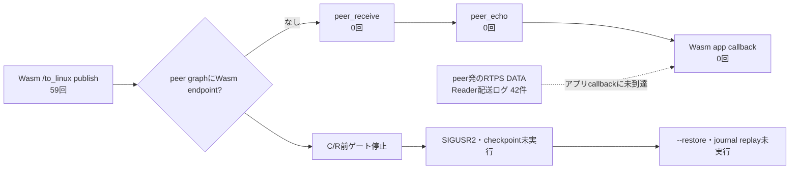

# run-01 結果

**結論:** C/R前の通信ゲートを通過できず、このrunではcheckpoint／restoreを実行していない。したがって、socket journalのdump／replayやC/R後の通信復旧については判定できない。

peerのROS graphにはWasm側endpointが現れず、Wasmのpublishからpeer受信、echo、Wasm callbackまでつながるmessageも確認できなかった。計画どおり、`SIGUSR2`と`--restore`は実行していない。

## 何を確認できたか

| 観測 | 60秒ゲート内の結果 | 根拠 |
|---|---:|---|
| Wasm `/to_linux` のpublish呼び出し | 59回 | `raw/wasm-checkpoint.log` |
| Wasm `/to_stm` のアプリcallback | 0回 | 同上 |
| peerの `/to_linux` 受信 | 0回 | `raw/ros-peer-gate-failed.log` |
| peerの `/to_stm` echo | 0回 | 同上 |
| peer graphで見えたWasm側endpoint | 0個 | 同ログのgraph snapshot 558件でpeer自身のendpointのみ |
| RTPS DATA parse／Reader配送ログ | 42件 | Wasmログ。アプリcallbackやmessage往復の証明には数えていない |

peer graphでは全558 snapshotで、`/to_linux` はpeer自身のsubscription 1つだけ、`/to_stm` はpeer自身のpublisher 1つだけだった。Wasm publisherとWasm subscriberはpeer側graphに現れず、peerの受信callbackも動かなかった。

### 図: 今回通った境界

RTPS層ではpeer由来のDATAをparseし、`reader_found=1`／`newChange`まで記録した例があった。ただし対応するpeer graph endpoint、peerの受信・echo、Wasm app callbackがないため、これは要求したpub/sub往復が成立した根拠にはならない。

## 時刻と計画との差

- Wasm起動: `2026-09-27T04:04:35.892Z`
- 60秒ゲート期限: `2026-09-27T04:05:35.892Z`
- Wasm終了: `2026-09-27T04:07:44.428Z`、SIGTERM、exit status `143`
- checkpoint用state directory: 空。checkpoint image／journal dumpは作成されていない。

停止判断が遅れ、Wasmは計画の60秒を越えて合計約188.5秒動作した。ゲート結果は起動から60秒までのログで判定し、期限後の観測をゲート通過の根拠にはしていない。C/Rシグナルは一度も送っていない。この計画逸脱も次回実行前に是正し、期限に達したら直ちに停止できる監視手順にする。

peer containerの終了時には、`rclpy.shutdown()`が既に呼ばれた旨のcleanup tracebackが出た。これは観測終了後のcontainer停止時に発生し、ゲート内のgraph／message記録とは分けて保存した（`raw/ros-peer-stop-tail.log`）。

## 次に調べること

現時点で特定できたのは「Wasm側endpointがpeer graphへ現れず、app-level往復がない」という境界まで。RTPS DATA配送ログはある一方でgraphにendpointがないため、次回はSPDP／SEDPのUDP packetがpeer interfaceまで届くかと、受信後にendpoint情報が登録されるかを分けて観測する。原因を決めつけずに診断方法を計画へ追加し、Solの再レビュー後にゲートからやり直す。
