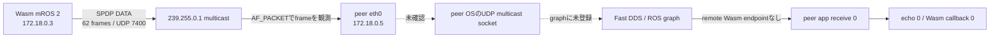
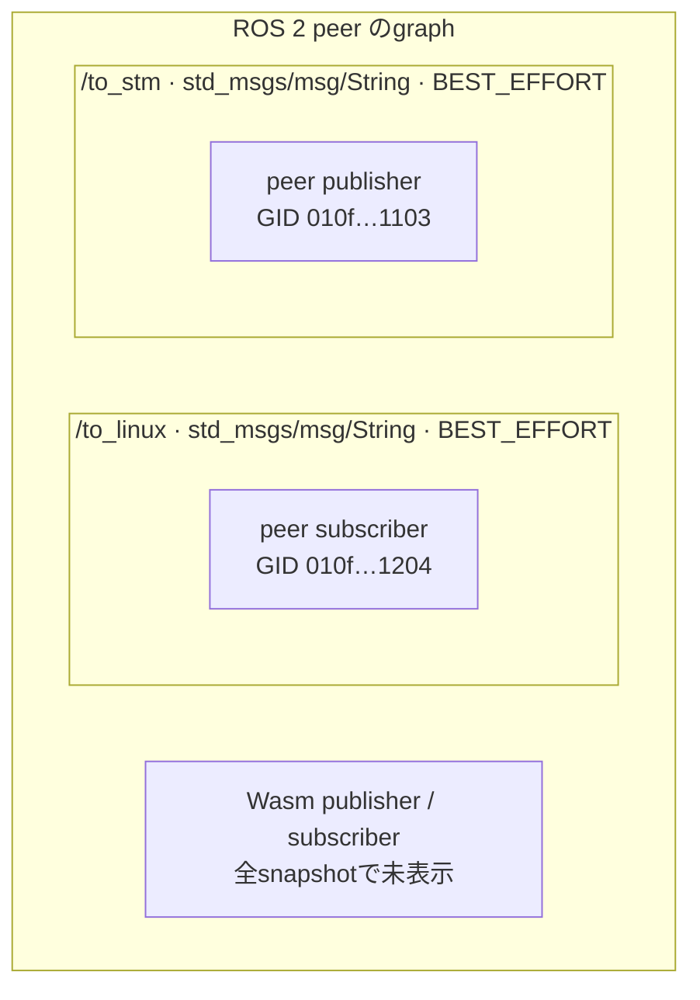
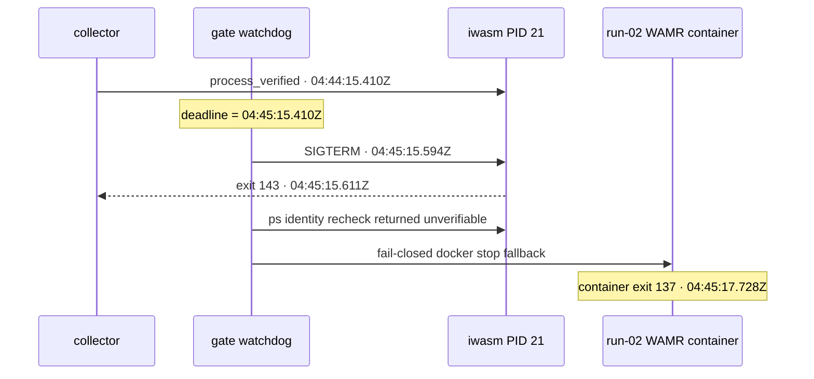

# run-02 実験結果

**結論:** run-02はC/R前ゲート不通過で停止した。Wasmが送ったSPDP participant announcementはpeerの`eth0`で見えたが、ROS graphにはWasm endpointが現れず、アプリmessageの往復もなかった。計画どおりSIGUSR2／restoreは実行していない。これはC/R復旧失敗ではない。

run-01と同じnetwork・IP・image・endpoint・runtime/Wasm artifactで、peer側に受動wire captureを追加した。Solはこのrun-02計画を、peer graph GID/countとmessage-ID往復をゲート証拠とする改訂後に承認した。

## 1. 実験結果

| 観測点 | 結果 |
|---|---|
| Wasm app `/to_linux` | 59回publish開始、59回`publish_return`。ID `0–58` |
| Wasm app `/to_stm` callback | 0回 |
| peer graph | 274 snapshotsすべてでpeer自身のendpointだけ。remote Wasm publisher/subscriberなし |
| peer app | `peer_receive` 0件、`peer_echo` 0件 |
| peer `eth0` wire capture | Wasm発のRTPS multicast frameを観測。SPDP builtin writer ID `000100c2`を含む |
| Wasm RTPS内部ログ | `RTPS_DATA parse=ok`／`reader_found=1`／`newChange`が42件。アプリmessage往復には数えていない |
| C/R | **未実施**。SIGUSR2、checkpoint image、restore、journal replayなし |

### 図1: 今回どこまで届いたか

wire observerはAF_PACKETで`eth0`を読みました。promiscuous mode、UDP portへのbind、multicast join、packet送信、ROS node作成はしていません。したがって、このcaptureは「frameがpeer interfaceに来た」証拠です。peerのUDP socketが受け取ったか、Fast DDSがそのparticipant packetを処理したかまでは示しません。

## 2. discovery packetで観測した内容

`peer-wire.jsonl`には336個のRTPS/UDP frameが記録されています。そのうち62個は`.3 → 239.255.0.1:7400`で、最初は`04:44:15.623Z`、最後は`04:45:14.642Z`です。全62個でDATA entityのwriter IDは`000100c2`、reader IDは`000100c7`でした。

mROS 2の[`types.h`](../../../../../mros2/embeddedRTPS/include/rtps/common/types.h)は`000100c2`を`ENTITYID_SPDP_BUILTIN_PARTICIPANT_WRITER`、`000100c7`を対応するparticipant readerとして定義しています。このため、観測した62 frameはWasm参加者のSPDP announcementと判定できます。RTPS headerはversion `02.02`、vendor ID `0d25`、GUID prefix `cf94952f06cd6223d15c1c00`です。

| peer interface上の通信 | frame数 | 観測できたこと |
|---|---:|---|
| `.3 → 239.255.0.1:7400` | 62 | WasmのSPDP builtin participant writer `000100c2` |
| `.3 → .5:7410` | 12 | RTPS `0x07` submessageのみ。DATA entity IDを含まず、user-dataとは数えない |
| `.5 → .3:7410` | 193 | RTPS frame。うち27個はSPDP writer ID `000100c2`、残り166個はDATA entity IDなし |
| `.5 → 239.255.0.1:7400` | 69 | peer側SPDP builtin participant writer `000100c2` |

### 図2: peer graphが示したendpoint

`/to_linux`はpeer自身のsubscription 1つだけ、`/to_stm`はpeer自身のpublisher 1つだけでした。GIDはそれぞれ`010f06410100ffff00000000000012040000000000000000`と`010f06410100ffff00000000000011030000000000000000`です。274 snapshotsのいずれにもremote Wasm GIDはありません。

## 3. 60秒ゲートと停止

### 図3: watchdogが止めた時刻

watchdogは`process_verified`に記録されたmonotonic時刻から60秒を計算しました。deadline時点でgate markerはなく、iwasm PID `21`にSIGTERMを送りました。collectorは約17ms後にexit status `143`を記録しましたが、直後のwatchdog側`ps`確認が空のargvを返し、終了を検証できませんでした。fail-closed規則に従ってrun-02専用WAMR containerを停止し、container exit codeは`137`でした。これはwatchdogの停止確認経路の問題で、C/Rの成否ではありません。

peer wire observerには`capture_ready`と`capture_stop`が残っています。計測後のpeer shutdownではrclpyの`ExternalShutdownException`がROS logに出ました。これはgate終了後のcleanup時だけで、計測中のmessage受信／echoは0件でした。

## 4. この実験から言える範囲

1. Docker network上で、Wasm発SPDP announcementのframeがpeerの`eth0`まで到達した。
2. peer ROS graphはその間もWasm publisher/subscriberを表示しなかった。
3. `eth0` captureとROS graphの間、つまりpeer側UDP multicast受信またはFast DDS discovery処理のどこで止まったかは未確定。
4. したがって、C/R前提のendpoint matchingとuser-data往復が成立しておらず、C/Rを評価できない。

次に切り分ける境界はpeer network namespace内のmulticast group membershipとUDP discovery socketの受信状態です。`/proc/net/igmp`と`/proc/net/udp`などの読み取り記録を加えれば、interfaceで見たframeがFast DDSの待受socketへ渡る前に止まるのか、Fast DDSが受けた後にparticipantとして登録しないのかを調べられます。どちらの結果でも、network・IP・QoSは変えずに行います。

## 5. 主なraw artifacts

- [Wasm collector log](raw/wasm-checkpoint.log)、[collector status](raw/wasm-checkpoint.status)
- [peer ROS log](raw/ros-peer-run-02.log)、[gate時点のpeer log snapshot](raw/peer-gate-snapshot.log)
- [受動wire capture](raw/peer-wire.jsonl)、[observer stdout](raw/wire-tap.stdout.log)
- [watchdog log](raw/gate-watchdog.log)、[watchdog status](raw/gate-watchdog.status)
- [run-02 network post-cleanup](raw/network-post-cleanup.json)、[WAMR post-gate inspect](raw/wamr-post-gate-inspect.json)
