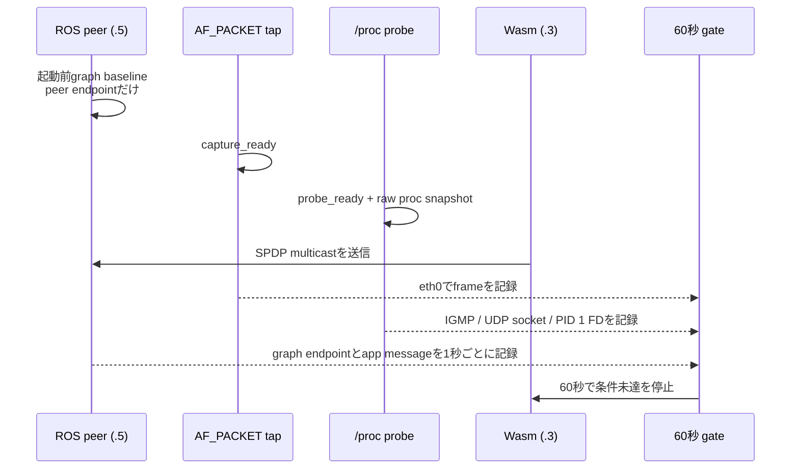
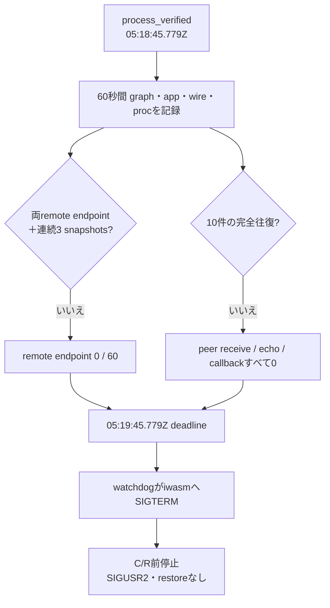

# Socket Journal C/R 実験ログ — run-03

## 結論

**run-03の診断実験は完了したが、60秒のC/R前ゲートを通らず、このrunではcheckpoint／restoreを実施していない。** WasmからのSPDP multicast frameはpeerの`eth0`で62件観測できた。さらに、peer側では`239.255.0.1`へのIGMP membershipと、PID 1が持つUDP `7400`・`7410`・`7411`のsocketを確認した。一方、60回のpeer graph snapshotでWasmのremote endpointは一度も現れず、peer受信・echo・Wasm callbackも0件だった。

この研究でC/Rを試したのは今回が初めてではない。2026-09-24の探索的runではcheckpoint/restore後に`recvfrom()`の`EINTR`と4 socketの再作成を記録した。ただしpeer graphにWasm endpointはC/R前後とも現れず、app-level roundtripも確認できていない。run-03でC/R前のendpointとmessage gateを置いたのは、以前のsocket復旧ログをROS通信復旧の証拠と混同しないためである。過去runの整理と根拠は[2026-09-24探索的C/Rレポート](../../../2026-09-24/runs/exploratory-cr-01/report.md)にまとめた。

今回の計測で「peerがmulticast groupへ参加していない」「peerにRTPS用UDP socketがない」は原因候補から外れた。ただし、interface到着後にkernelがframeを特定socketへ渡したことや、Fast DDSがそのSPDPを処理したことまでは証明できていない。したがって、未解決の境界は**peerのinterface到着からFast DDSのparticipant／endpoint登録まで**に残る。C/R前ゲート不通過をC/Rの失敗とは扱わない。

### 図1: 今回の観測で分かった範囲

```mermaid
flowchart LR
    W[Wasm participant<br/>172.18.0.3] -->|62 SPDP frames<br/>239.255.0.1:7400| E[peer eth0<br/>frame到着を確認]
    E -->|/proc/net/igmp<br/>group membershipあり| I[peer kernel]
    I -->|PID 1 FDにUDP<br/>7400 / 7410 / 7411| S[peer socket table]
    S -. socketへの実配送は未確認 .-> F[Fast DDS discovery処理]
    F -->|remote Wasm endpoint 0 / 60 snapshots| G[peer ROS graph]
    G -->|peer receive 0<br/>echo 0 / callback 0| A[アプリ通信]
```

この図の実線はそれぞれ個別の観測事実で、socket受信やFast DDS処理の証明にはつながらない。`/proc/net/igmp`はgroupをinterface単位で示し、socket単位のmembershipは示さない。

## 実験条件

run-02と同じnetwork、ROS image、IP、endpoint、runtime、Wasmを使用した。起動前にnetworkのattachmentが0、run-03のraw directoryが空、state pathが未作成であることを確認した。実験中はnetworkにpeer `.5`とWAMR `.3`だけを接続した。

| 条件 | 実測値 |
|---|---|
| Docker network | `mros2-cr-net`, ID `609362e37c7a945ba44d7f2416fe24159ed9d9adb36207f8eb844b95b3c37408`, subnet `172.18.0.0/16` |
| peer / WAMR | ROS peer `172.18.0.5`、WAMR runner `172.18.0.3` |
| ROS image | `ros:humble`, image ID `sha256:1813d3c85d7f96ff7d3012d865204583255740182db5d0065f8f8cd029a83138` |
| iwasm / Wasm | `96c9f1ae89a29e8b2ab87eccdb54df4f7e6203be6945413cc19052df09f3920a` / `0a725f9a303650a64358964a6f6ef0cd84d5cc82734fcbeb87ec8f7dd1d8df76` |
| ROS endpoints | peer `/to_linux` subscriber・`/to_stm` publisher、Wasmは逆方向。`std_msgs/msg/String`、BEST_EFFORT / VOLATILE |
| state | 新しい`/tmp/mros2-wasm-cr-rerun-20260927/state-run-03`。開始時・終了時とも空 |

root revision、submodule revision、command、image/container inspect、hashは[`raw/`](raw/)に保存した。peer内に`ip` commandがなかったため、`ip address`と`ip route`はexit 127。IP・prefix・gatewayはDocker inspect、routeは`/proc/net/route`と`/proc/net/dev`から記録した。Docker bridgeは`/16`だがWasm lwIP netifは`172.18.0.3/24`と表示され、この差はrun-02と同じままだった。これが今回の不通過原因だとは結論できない。

## 何を計測したか

今回足したprobeはpeer container内で1秒ごとに`/proc/net/igmp`、`/proc/net/udp`、`/proc/net/udp6`、`/proc/1/fd`を読む。socketを作らず、UDPへbindせず、multicast groupへjoinせず、ROS nodeも作らない。別processのAF_PACKET tapは`eth0`のRTPS frame headerだけを受動観測する。

### 計測結果

| 観測点 | 結果 | ここから言えること |
|---|---|---|
| Wasm SPDP送信 → peer `eth0` | `.3 → 239.255.0.1:7400`のRTPS frame 62件。writer ID `000100c2` | SPDP frameがpeer interfaceへ届いた |
| peer IGMP | `eth0`に`239.255.0.1`、users=1。gate中60 snapshotすべてでprobeは完全 | peer namespaceでgroup membershipが見える |
| peer UDP socket | PID 1 FD mapで`0.0.0.0:7400`→FD 9、`:7410`→FD 10、`:7411`→FD 12。gate中のFD列挙不完全は0 | peer PID 1が該当IPv4 UDP socketを持つ |
| peer ROS graph | gate中60 snapshots。Wasm publisher/subscriberのremote GIDは0 | peer graphにWasm endpointが登録されなかった |
| user-data | Wasm publish begin/return marker各60、peer receive 0、peer echo 0、Wasm callback 0 | app messageの往復は確認できない |
| Wasm側の受信log | peer participant prefixとbuiltin participant reader/writer IDを含む`RTPS_DATA parse=ok`がある | Wasm側がpeerのSPDP DATAを処理した記録と整合する。peer側の発見状態は対称ではない |

RTPS builtin entity IDは[`types.h`](../../../../../mros2/embeddedRTPS/include/rtps/common/types.h)で定義され、participant writer/readerの生成は[`Domain.cpp`](../../../../../mros2/embeddedRTPS/src/entities/Domain.cpp)にある。raw logの出力は複数thread間で一部連結されるため、各行の全fieldやmarker数だけから細かい順序を推定しない。最終publish returnもwatchdog停止時に途中で切れている。gate判定はpeer graph、peer受信／echo、Wasm callbackの各独立ログで行い、いずれも必要数に達しなかった。

### 図3: gateの時間と判断

watchdogは`process_verified`から60秒で停止した。SIGTERM後のPID/argv再確認が不確実だったため、watchdogは最後の安全策としてrun-03のWAMR containerを停止した。collectorのstatusは143、containerはexit 137。runner停止前にgate pass markerはなく、restoreもjournal dump/replayも開始していない。

## 解釈と次の切り分け

run-02とrun-03ではnetwork、IP、image、runtime/Wasm hash、ROS endpoint条件を揃えたまま、peer interface captureの結果を再現した。run-03の追加計測ではpeerのIGMP membershipとUDP socket bindも見えたため、**次に見る境界はpeer kernel socketからFast DDS discovery処理への配送・登録**になる。ただし現ログは特定socketへの受信やFast DDS内部のSPDP parseを直接計測していないので、drop地点を断定しない。

次の診断では、peer側Fast DDSのUDP受信／SPDP処理を示す観測を追加する必要がある。socket tableやinterface captureだけでは、この境界は閉じない。C/Rを開始するのは、peer graphで両方向endpointが見え、同じIDのアプリ往復が成立した後に限る。

## 保存したログ

- [`gate-summary.json`](raw/gate-summary.json): 結果の機械可読summary。
- [`peer-socket-state.jsonl`](raw/peer-socket-state.jsonl): 全probe snapshotsとraw `/proc`表。
- [`peer-wire.jsonl`](raw/peer-wire.jsonl): peer `eth0`の受動RTPS frame記録。
- [`wasm-checkpoint.log`](raw/wasm-checkpoint.log): Wasm/WAMR診断logとpublish記録。
- [`ros-peer-run-03.log`](raw/ros-peer-run-03.log): peer graph・受信・echo log。
- [`gate-watchdog.log`](raw/gate-watchdog.log), [`gate-watchdog.status`](raw/gate-watchdog.status): deadline停止記録。
- `raw/`にはnetwork/container inspect、route、process list、artifact hash、cleanup後状態も保存した。

run-03計画のSol承認とraw logはGit indexに追加済み。root repositoryのcommitは作成していない。
