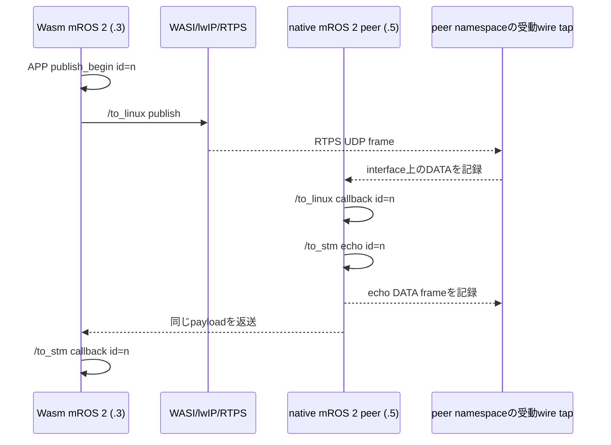

# run-04計画：native mROS 2 peerへのWasmアプリデータ配送

## 結論と目的

今回まず確認するのは、WAMR上のmROS 2アプリが`/to_linux`へpublishした連番メッセージを、**native mROS 2 peerのsubscription callbackが実際に受け取ること**。`publish()`の呼出しやUDP送信成功だけでは受信成功としない。

この60秒ゲートを通り、同じIDのpeer echoとWasm callbackまで10件確認できた場合だけ、30秒の無C/R基準区間を経て、承認済み手順の同一IP C/Rへ進む。ゲート未達ならC/Rは実施しない。

## 9/17 surveyに合わせる条件

| 項目 | 9/17に合わせる実験条件 |
|---|---|
| 通信相手 | ROS 2 `rclpy`ではなく、POSIX版のnative mROS 2 node |
| アプリ | Wasmが`/to_linux`へ`std_msgs/msg/String`を1秒ごとに連番publish。peerが同じ本文を`/to_stm`へecho |
| endpoint方向 | Wasm: publisher `/to_linux`・subscriber `/to_stm`。native peer: subscriber `/to_linux`・publisher `/to_stm` |
| domain | 0 |
| 配置 | 同一ホストの別container、Wasm `172.18.0.3`・native peer `172.18.0.5` |
| 決定的な受信証拠 | Wasmのpublish IDと一致するnative peerの`peer_receive` callback ID |

9/17のIPは`192.168.100.3` / `192.168.100.5`。起動前のhost route確認では、このホスト自身が`192.168.100.0/24`を物理LAN `enp4s0`で使用し、`.3`にも物理LAN側のneighborがあった。このため同じCIDRは使わず、既存の隔離Docker bridge `mros2-cr-net`（`172.18.0.0/16`）を使うことをユーザーが承認した（2026-09-27）。IPが9/17と異なる点は結果に明記する。実行直前にもnetwork attachmentと固定IPの競合がないことを確認する。

## native peerの作り方

- 既存のdirtyな`/home/osslab/mros2-posix-worktree`は変更せず、run専用のsource copyを`/tmp`に作ってビルドする。
- peer実装はこのrunの[`native_peer.cpp`](native_peer.cpp)。native mROS 2で`/to_linux`をsubscribeし、受信IDをログに出してから同じ本文を`/to_stm`へpublishする。
- POSIX版の`Config::IP_ADDRESS`はlocatorにも使われる。隔離networkに合わせてsource copy内だけを`.5`へ変更するpatchを[`native-peer-ip.patch`](native-peer-ip.patch)に保存する。
- ROS 2 Humble imageは実行環境として使っても、peer processはrclpy/RMW nodeではなくビルドしたnative mROS 2 executableとする。

## 観測と判定

`peer_receive id=n`と`APP publish_begin id=n`の一致が、今回の主目的であるnative peerでのアプリデータ受信の証拠。wire captureは補助証拠で、単独ではアプリ配送の証明にしない。

60秒以内に10個の異なるIDで`Wasm publish → peer receive → peer echo → Wasm callback`が揃ったらC/R開始条件を満たす。C/R前の30秒でも新しい10個以上の完全な往復を確認する。どちらかが満たされなければ、最後に確認できた境界を記録して停止する。

計測ログ:

- Wasm `APP publish_begin` / `publish_return` / subscriber callback
- Wasm WASI `sock_send_to`・`sock_recv_from`とlwIP/RTPS受信ログ
- native peer callbackの受信ID・echo publish結果
- peer network namespaceのAF_PACKET受動capture（RTPS DATAとlocator/port）
- container/network inspect、実行command、source revision、各artifact hash、state imageとC/R status

## 安全・成果物

- 既存Docker networkは起動直前にattachment 0、`.3/.5`未使用を再確認する。network自体は変更・削除しない。
- checkpoint stateとbinaryは`/tmp`のrun専用path。再利用・上書きをしない。
- Git管理対象のsource・手順・report・raw logはこの`run-04/`へ保存する。既存のstaged変更は変更しない。commit/pushはしない。
- cleanupはこのrunで作ったcontainerだけに限定する。
