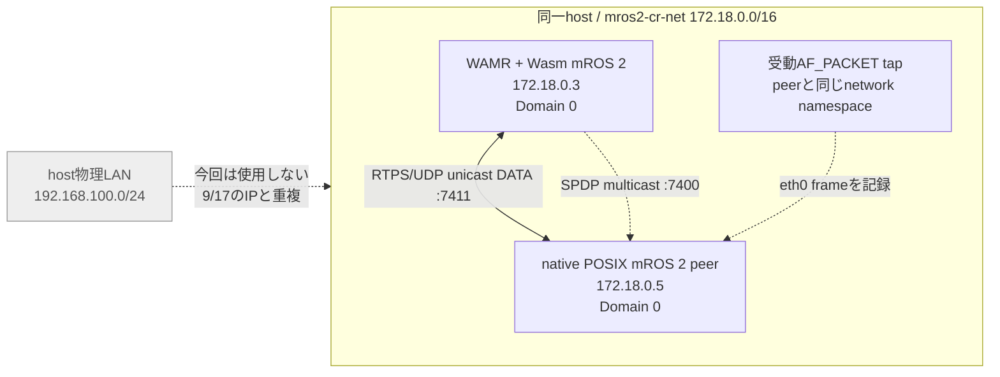
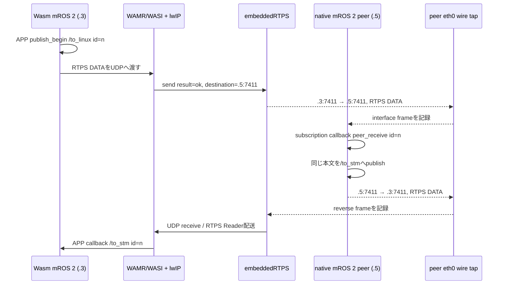
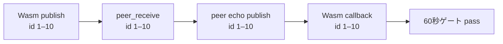
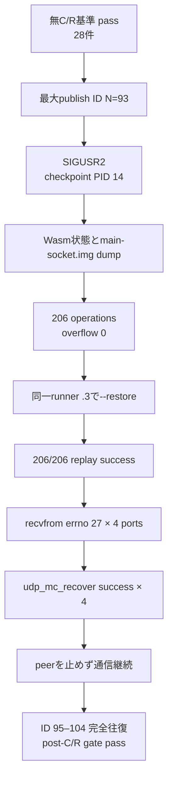
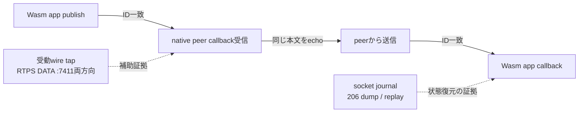

# Socket Journal C/R 実験レポート — run-04

## 結論

**native mROS 2 peerでWasmのアプリデータ受信を確認し、同じIP・同じpeerのまま行ったsocket-journal checkpoint/restore後にも、10件の新しい完全往復が再開した。** C/R前のゲートと30秒の無C/R基準も通過している。したがって今回は、9/24に不足していた「peerがアプリデータを受け取る」という前提を満たしたうえで、C/R後の通信を評価できた。

| 判定点 | 結果 |
|---|---|
| Wasm → native mROS 2 peerのアプリ受信 | 受信callbackでID 1–10を確認 |
| peer echo → Wasm subscriber callback | 同じID 1–10を確認 |
| C/Rなしの通信継続 | 30.095秒で新規28件の完全往復 |
| checkpoint / socket journal dump | 完了。206 operations、overflow 0 |
| socket journal replay | 206/206 success、failure等0 |
| restore後のsocket recovery | 4 UDP portで`errno=27`の後、4件すべてrecovery `ok` |
| C/R後の新規app往復 | 最大pre-C/R ID 93より大きいID 95–104の10件 |

結論の適用範囲は**この1回の、同一host・同一Docker bridge・同一IP・同一native peer・同一artifactでの実験**に限る。9/17と同じ`192.168.100.3/.5`ではなく、物理LANとのCIDR重複を避けるため、承認を得て`172.18.0.3/.5`を使った。別host、IP変更、任意のnetworkでの移行や一般的な成功率までは示さない。

## 実験の配置

peerはROS 2 `rclpy` nodeではない。POSIX版native mROS 2 sourceの隔離copyから作った実行ファイルで、`mros2::init(0, NULL)`を呼び、`/to_linux`をsubscribe、`/to_stm`をpublishする。`ros:humble`はコンテナのOS/runtime imageとしてだけ使った。

9/17 surveyとの違いはnetwork CIDRだけでなく、測定上の前提にもある。9/17と同じくtopic・message型・endpoint方向・native mROS 2 peerを揃え、今回は「peerがWasmのデータを受信すること」をC/R開始条件として実測した。

## 1つのIDが通った経路

この経路では証拠の役割を分けた。Wasmの`publish_return`やUDP `sendto()`成功だけではpeer受信とはしない。今回の決定的な受信証拠はnative peer application callbackの`peer_receive`である。同じIDのWasm callbackが返り、さらにwire tapで`:7411`の両方向RTPS DATAを観測した。

`peer-wire.jsonl`はRTPS submessage/headerとlocator/portを記録するが、application payloadを復号してIDを読むものではない。IDの突き合わせはWasmとnative peerのapplication logで行う。

## ゲート結果

### C/R前

60秒ゲートは`process_verified`から約11.4秒でpassし、ID `1–10`について次の4種類の記録が一致した。

続く無C/R基準は30.095秒。異なる28 ID `28–44`および`46–56`の完全往復を確認した。ID 45は完全往復集合に含まれない。基準区間がpassしたので初めてC/Rへ進んだ。

### Checkpoint / restore

Checkpoint signal直前の最大Wasm publish IDは93。restoreでは`main-socket.img`から206件をreplayし、summaryは`successful_count=206`, `failure_count=0`, `fallback_count=0`, `skipped_count=0`, `unknown_count=0`, `function_return=0`だった。restore直後の4つの`recvfrom()`（local UDP port 7400・7401・7410・7411）では`errno=27`が記録されたが、4件ともmROS 2/lwIP側の`UDP_RECV_RECOVERY result=ok`が続いた。

Restore後のID 94 callbackはC/R境界をまたいだin-flight messageとして現れた。post-C/Rゲートはrestore側logにpublish beginも記録されたID `95–104`を使い、10件の異なる往復を確認した。gate pass後にcollectorを明示的にSIGTERM停止したため、`wasm-restore.status`のexit 143はゲート失敗ではない。

### 観測境界と意味

ここから言えるのは、測定した1回の同一IP C/R後に、アプリレベルの往復が再開したことまで。`SIGUSR2`が`errno=27`を起こす因果関係は、signalなし対照がないため判定していない。socket journalが他hostやIP変更をまたいで動くことも、このrunでは検証していない。

## 生ログと再現情報

| 根拠 | ファイル |
|---|---|
| C/R前のID突合ゲート | [`raw/roundtrip-gate.log`](raw/roundtrip-gate.log), [`raw/roundtrip-gate.status`](raw/roundtrip-gate.status) |
| 30秒無C/R基準 | [`raw/no-cr-baseline.log`](raw/no-cr-baseline.log), [`raw/no-cr-baseline.status`](raw/no-cr-baseline.status) |
| signalと最大ID | [`raw/checkpoint-signal.log`](raw/checkpoint-signal.log) |
| checkpoint / journal dump | [`raw/wasm-checkpoint.log`](raw/wasm-checkpoint.log), [`raw/wasm-checkpoint.status`](raw/wasm-checkpoint.status) |
| restore / journal replay / EINTR recovery | [`raw/wasm-restore.log`](raw/wasm-restore.log), [`raw/wasm-restore.status`](raw/wasm-restore.status) |
| native peerが実際に受けた本文 | [`raw/peer-native.log`](raw/peer-native.log) |
| RTPS wire capture | [`raw/peer-wire.jsonl`](raw/peer-wire.jsonl), [`raw/wire-tap.stdout.log`](raw/wire-tap.stdout.log) |
| hash・state manifest・container/network | [`raw/artifact-hashes-run04-final.txt`](raw/artifact-hashes-run04-final.txt), [`raw/checkpoint-state-files.sha256`](raw/checkpoint-state-files.sha256), `raw/*inspect*`, `raw/network-*.json`, `raw/containers-*.txt` |

すべての実験ログとreportはGit repository内の`experiments/socket-journal-cr/2026-09-27/runs/run-04/`に保存した。checkpoint state本体は大きいため`/tmp`に残し、hashだけを保存した。実験用containerは削除し、共有Docker networkは変更せずattachment 0に戻した。
