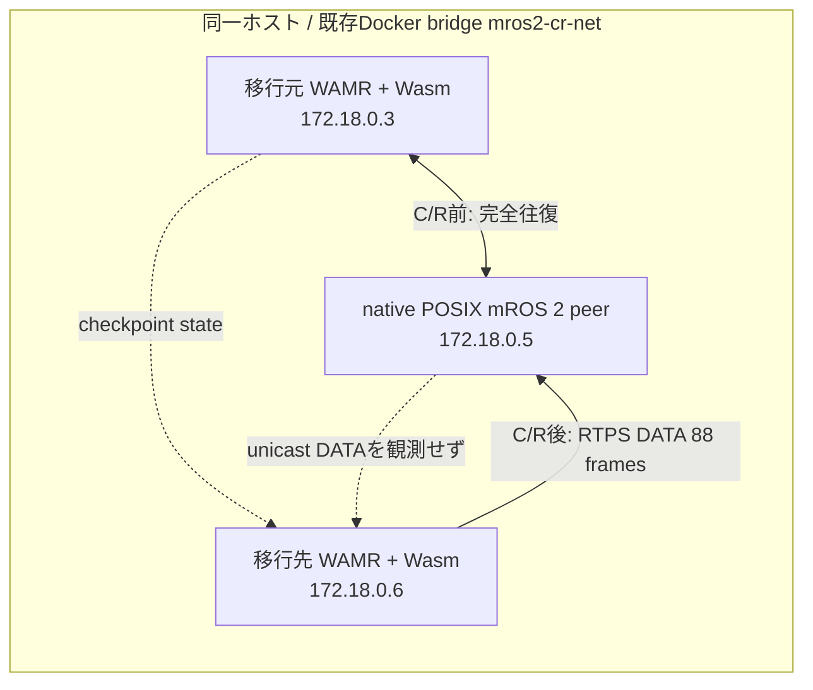

# run-06: Dockerの別IPへのSocket Journal C/R

**結論：別IPへのアプリレベル移行は確認できなかった。** Checkpointと182件のSocket Journal replayは完了し、restore後のWasmからnative mROS 2 peerへの送信・peer callback受信は確認できた。一方、peerからWasmへ戻るRTPS DATAと、checkpoint後の新しいWasm subscriber callbackは確認できず、90秒ゲートは不成立。

この試験は、同じ物理ホストのDocker containerを移行元`.3`、native peer`.5`、移行先`.6`として使った**別IP試験**。別の物理ホストへの移行を示すものではない。

レポートは[`report.md`](report.md)、実行時刻・artifact・判定値は[`metadata.md`](metadata.md)、承認された実行条件は[`plan.md`](plan.md)を参照。raw logと機械判定結果は[`raw/`](raw/)に保存している。

Socket Journalのstate本体は約1 GiBのためGitに含めず、`/tmp/mros2-wasm-cr-run06/state`に残した。ファイル一覧とSHA-256は[`raw/checkpoint-state-files.txt`](raw/checkpoint-state-files.txt)と[`raw/checkpoint-state-files.sha256`](raw/checkpoint-state-files.sha256)にある。
