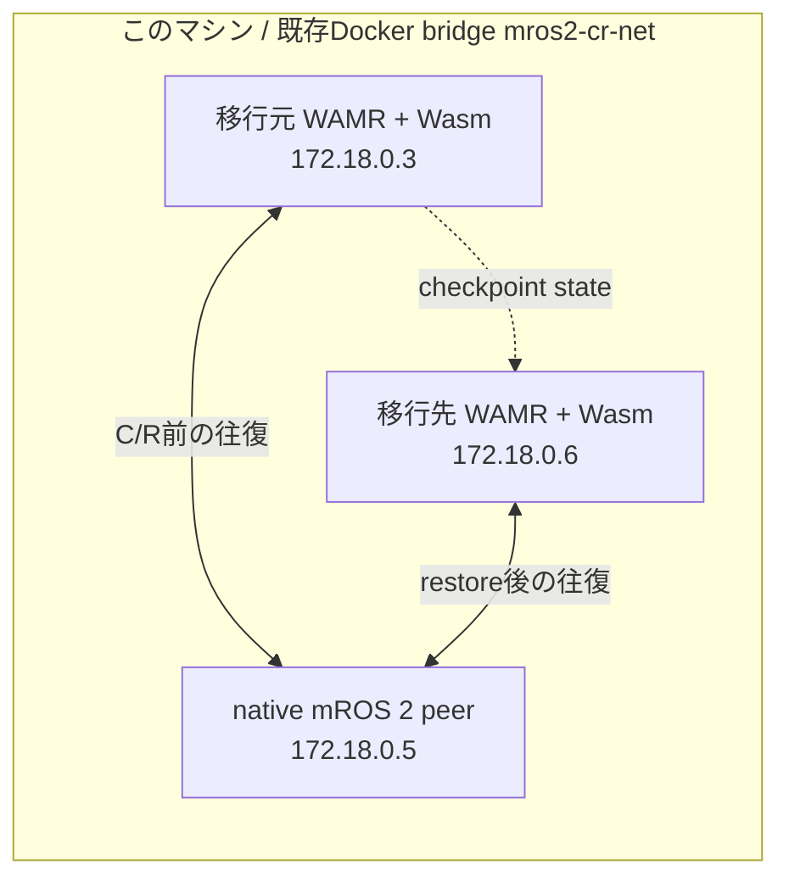

# run-06 計画案：Docker上の別IPへのsocket-journal C/R

**状態：実施済み。別IPでのアプリレベル往復ゲートは不成立。** 計画承認後、同一ホスト上のDocker container間で1回実施した。checkpointとSocket Journal replayは完了したが、restore後の完全往復は90秒ゲート内で確認できなかった。結果と逸脱は同じディレクトリの[`report.md`](report.md)に記録した。

## 目的と範囲

run-04で成功した同一IP C/Rに対し、今回は同じ物理ホスト上のDocker containerを移し先に見立て、Wasm mROS 2 nodeを別IPでrestoreした後もnative mROS 2 peerとのアプリデータ往復が続くかを調べる。

これは**同一ホスト内の別container・別IPへの移行試験**であり、物理的な別ホストへの移行を証明する試験ではない。移行元と移行先で同じホストkernelと既存Docker bridgeを共有する。

## 固定する条件

| 項目 | 計画 |
|---|---|
| Docker network | 既存の`mros2-cr-net`のみを使う。作成・削除・再設定しない |
| IP | 移行元`.3`、native peer`.5`、移行先`.6`を候補とし、開始直前に競合がないことを確認 |
| 通信相手 | run-04と同じnative POSIX mROS 2 peer。`rclpy`/ROS 2 peerに置き換えない |
| アプリ通信 | Wasm publisher `/to_linux` → peer subscriber → peer echo `/to_stm` → Wasm subscriber callback |
| 実行物 | run-04と同じ`iwasm`とWasm artifactを使い、両方のSHA-256を照合 |
| checkpoint state | run-06専用の新規`/tmp`領域。run-04の約1.1 GiB stateは再利用・上書きしない |

## 手順と中止ゲート

1. **読み取り専用の事前確認**：Docker networkのID・subnet・接続container、候補IP、run-06用container名、Docker image、run-04 runtime/Wasm/native-peer artifactのhash、必要な空き容量を記録する。`.3/.5/.6`または名前が使用中、artifact不一致、状態が想定外なら、何も変更せず中止して報告する。
2. **実験containerを作成**：このrun専用の移行元WAMR、native peer、受動wire observerを既存networkへ接続する。移行元は`.3`、peerは`.5`。既存networkやホストのinterface・route・firewallは変更しない。
3. **C/R前の通信ゲート**：60秒以内に、異なる10個のIDそれぞれで`Wasm publish → peer_receive → peer echo → Wasm callback`を確認する。続けて30秒の無C/R基準を取り、新しい完全往復が10件以上あることを確認する。どちらかが不成立ならcheckpoint前に止める。
4. **checkpoint**：ゲートpass後にのみ、検証済みの移行元`iwasm`へ既定のcheckpoint signalを送り、終了status・journal dump・checkpoint時の最大publish ID `N`を記録する。PIDとcommand lineが想定と違えばsignalを送らない。checkpoint後は移行元`iwasm`だけを停止し、native peerは動かし続ける。
5. **別IPでrestore**：移行元と同じread-only runtime/Wasm artifact、および同じrun-06 state directoryを、移行先`.6`の新しいWAMR containerにマウントしてrestoreする。移行元プロセスが停止済みであることを再確認し、peer`.5`は止めない。
6. **restore後の通信ゲート**：journal replayの結果に加え、`recvfrom`/UDP recovery、wire上のRTPS DATA、native peerの受信callback、Wasm callbackを別々に記録する。`N`より大きい異なるIDについて10件の完全往復が成立した場合だけ成功とする。成功しない場合は、最後に確認できた境界を記録してその試行を終了し、条件を変えた再試行はしない。
7. **記録とcleanup**：手順・report・raw log・artifact hash・前後のDocker状態をこの`run-06/`以下に保存する。checkpoint本体はGitに入れず`/tmp`に置く。cleanupはこのrunで作成したcontainerだけに限定し、共有networkは残す。commit/pushは行わない。

## 重要な解釈上の注意

移行先containerのDocker IPが`.6`でも、Wasm内のmROS 2/RTPS locatorが`.3`のままなら、移行後に古いlocatorを広告・使用する可能性がある。したがって、事前確認とログでは**Dockerが割り当てたIP**と**RTPSが広告・使用したlocator**を区別する。

このrunでは同一artifactでの移行を評価するため、失敗してもWasmやsubmoduleのIP設定は変更しない。locator不一致が見つかった場合はその事実を結果として残して停止し、移行先向けに設定を変えた別artifactでの試験は、別計画として改めてレビューを受ける。

## 保存する証拠

- run開始前・container作成後・cleanup後のDocker network/container inspect
- image ID、runtime/Wasm/native-peerのSHA-256、実行command、process PID/argv
- container内のIP/routeとRTPS locator、Wasmのpublish/callback ID
- native peerの受信/echo ID、受動wire observerのRTPS/UDP記録
- C/R前ゲート、30秒基準、checkpoint、restore、C/R後ゲートのlogと機械判定status
- cleanup対象とcleanup後の状態

raw logは`experiments/socket-journal-cr/2026-09-27/runs/run-06/raw/`に保存し、Git管理下に置く。checkpoint stateそのものは保存しない。

## 実行しないこと

- このマシン以外へのSSH・ログイン・コマンド実行
- 別の物理ホストを移行先にすること
- Docker networkの作成・削除・subnet変更、ホストnetwork設定の変更
- run-04 stateの流用、既存containerの停止・削除
- `mros2`/`lwip-wasm`/WAMRやアプリsourceの変更・再build
- このrunのcommit/push

## 以前の別ホスト案の残存物

先行する誤った別ホスト案向けに生成された`build_native_peer.py`、`native-peer-ip.patch`、`native_peer.cpp`、`raw/build-native-peer.log`は、今回の実験開始前にrun-06から取り除いた。別ホスト前提の`.11`設定やpeer build結果は今回使わない。対応する一時build出力が`/tmp`に残っているが、今回の試験では参照しない。
