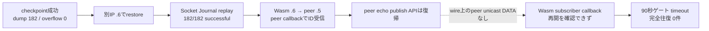
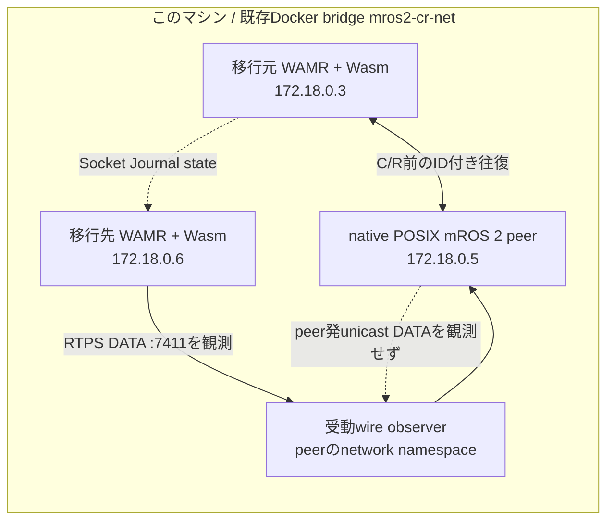
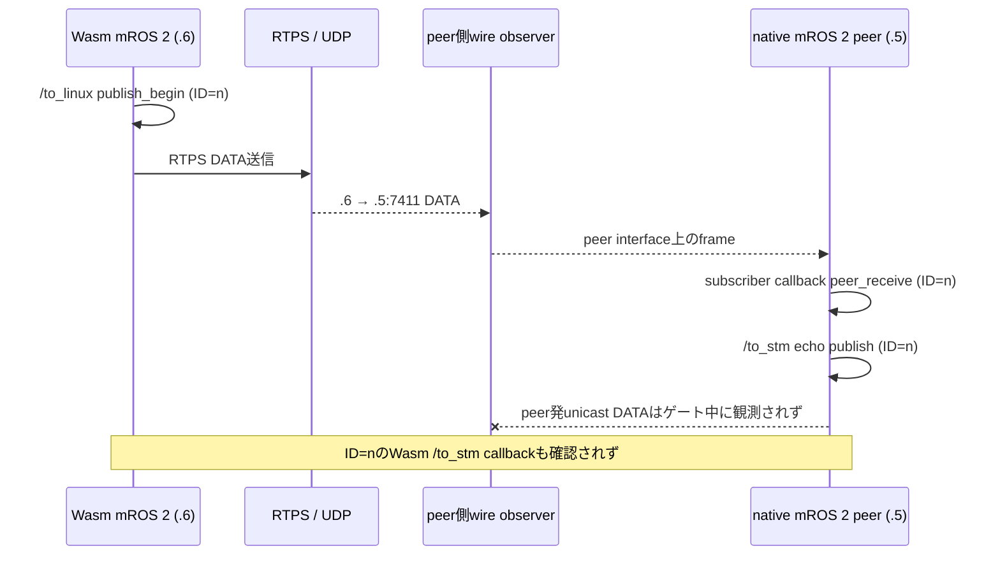

# Socket Journal C/R 実験レポート — run-06

## 結論

**Wasm mROS 2 nodeをDocker上の別IPへrestoreした後、Socket Journal replayとWasmからnative peerへのアプリデータ配送までは確認できた。しかし、peerからWasmへ戻る通信が再開せず、アプリレベルの完全往復は不成立だった。** したがって、今回の別IP移行は成功とは判定しない。



今回の「移行」は同じ物理ホストにあるDocker container間の移動であり、別ホスト移行ではない。成功した範囲は、別IPでのrestore、socket-journal replay、およびrestore先からpeerへ向かうアプリデータ配送まで。peerのecho APIが呼ばれたことは、ネットワーク送信やWasmでの受信を意味しない。

## 配置と判定対象



通信相手はrun-04と同じnative POSIX mROS 2 peer。peerは`/to_linux`をsubscribeして受信IDを記録し、同じ内容を`/to_stm`へpublishする。Wasm側は`/to_linux`へpublishし、`/to_stm`のsubscriber callbackでIDを記録する。peerや移行先は別マシンではなく、既存の`mros2-cr-net`上の専用container。

受動wire observerはpeerとnetwork namespaceを共有してRTPS/UDP frameを記録した。packet injectionはしない。既存networkのIDとsubnetは実験前後で保存し、network自体は変更していない。

## 何を「完全往復」と数えたか



完全往復には、同じ新規IDについて次の4つすべてを要求した。

1. restore後のWasm publish
2. native peer subscriber callbackでの受信
3. native peerからのecho
4. Wasm subscriber callbackでの受信

APIの`publish()`が戻ることや送信側のログだけでは、次の層への配送を認定しない。wire frameとアプリcallbackも別々の証拠として扱う。

## 実験結果

| 判定点 | 結果 |
|---|---|
| C/R前の完全往復 | 18 distinct ID（5–22）で確認 |
| 無C/R基準 | 30.0875秒で27 distinct ID。通信が継続することを確認 |
| checkpoint | 成功。最大publish ID `N=81`、dump 182 operations、overflow 0 |
| 移行先restore | `.6`で起動し、Socket Journal 182/182をreplay。failure 0、fallback 2 |
| UDP受信socket recovery | 7400/7401/7410/7411の全portで`result=ok` |
| Wasm → peer | peer interfaceで`.6 → .5:7411`のRTPS DATA 88 frame。peer callbackはID 83–170を記録 |
| peer echo | peer logにID 83–170のecho publishを記録 |
| peer → Wasm wire | peer発`.5 → .6:7411`および旧IP`.5 → .3:7411`のDATAは各0 frame |
| Wasm subscriber callback | restore logにID 82のみ。checkpoint後の新しい完全往復IDは0 |
| 90秒ゲート | timeout、不成立 |

### Socket Journal自体はどうだったか

Checkpointは2026-09-27 11:18:10 UTCごろに開始し、exit 0で完了した。dumpは182 operationsでoverflowは0。移行先restoreでは182件すべてreplayされ、failure、skipped、unknownは0。fallbackは2件だった。

restore時に`netif_wasm`がlocal IPを`0x060012ac`へ更新した。Docker inspectで確認した移行先`.6`（`172.18.0.6`）と一致する。UDP receive recoveryも対象4 portすべてで`ok`だった。つまり、**journal replayとlocal-IP/socket recoveryが通ったことだけでは、RTPS endpoint間のアプリ通信が両方向に復帰したとは言えなかった**。

## どこまで通信を確認できたか

公式post-C/Rゲートはrestore processを確認した11:19:55.960 UTCから開始し、11:21:26.063 UTCに90秒timeoutとなった。この区間で確認できた境界を図にすると次のとおり。

```mermaid
flowchart LR
    A[Wasm publish ID 83–169<br/>87 IDs] --> B[.6 → .5:7411<br/>RTPS DATA 88 frames]
    B --> C[peer callback ID 83–170<br/>88 IDs]
    C --> D[peer echo publish ID 83–170<br/>88 IDs]
    D -. peer発unicast DATA<br/>.5 → .6/.3:7411 は0 frame .-> E[Wasm callback ID > 81<br/>0 IDs]
```

Wasm publish、peer receive、peer echoでID範囲に1件の差があるため、3つのログを単純に1対1対応させない。さらに、Wasm callbackで見えたID 82はcheckpoint最大ID `N=81`の直後だが、restore後publishの対応IDが確認できないため、境界に残っていたin-flight callbackとして除外した。`N`より大きいIDで4段階を満たす共通集合は0件。

wire captureの90秒区間集計では、`.6 → .5:7411`にDATA 88 frameを観測した一方、peer `.5`から`.6:7411`にも旧IP`.3:7411`にもDATAを観測しなかった。peerのmulticast discovery DATAは`.5 → 239.255.0.1:7400`に91 frameあった。これらは**旧IP宛て送信を示す証拠ではない**。この時間範囲に旧IP宛ての該当DATAは0件であり、peerがunicastを出さなかった理由やRTPS endpoint matchの有無は、このrunだけでは確定していない。

### 公式ゲート後の追加観測

timeout後、境界を受動確認していた間も同じrestore processが145.867秒動作し、peer logではID 171–316の受信とecho publishが追加で記録された。これは90秒ゲートの判定を変えず、2回目のrestoreや設定変更も行っていない。公式ゲート外であるため、成功ラウンドトリップ数には加えない。

ゲート後の停止時、helperは一度`[iwasm] <defunct>`を実行中processと誤認して停止確認を保留した。その後のprocess一覧では稼働中iwasmがないことを確認した。生ログは修正せず、`raw/wasm-restore-stop.log`と`raw/destination-processes-post-stop.txt`に保持した。

## 判定と次の調査境界

今回の結果から言えることは次のとおり。

- **確認できた:** checkpoint、Socket Journal dump/replay、移行先IPへの更新、4 UDP portのreceive recovery、移行先Wasmからnative peerへのアプリデータ配送。
- **確認できなかった:** peerからWasmへのunicast RTPS DATA送信、およびcheckpoint後の新しいWasm subscriber callback。完全往復は0件で、別IP移行の受け入れ条件は満たさない。
- **原因は未確定:** endpoint discovery/matching、peer writerの送信判断、または別のRTPS経路のどこで止まるかは、今回のログのみでは絞り切れない。古い`.3` locatorへの送信が起きたとも結論しない。

次の切り分け候補は、peer側で「対応するreaderがmatchしているか」と「writerがUDP sendを呼ぶか」を分けて記録すること。これは今回の設定を変えた再試行ではなく、追加計測として別途計画する。

## ログと再現情報

実行条件、hash、時刻、数値の一覧は[`metadata.md`](metadata.md)。主要ログは以下。

| 内容 | 証拠 |
|---|---|
| 実行計画 | [`plan.md`](plan.md) |
| C/R前 round-trip gate | [`raw/roundtrip-gate.log`](raw/roundtrip-gate.log), [`raw/roundtrip-gate.status`](raw/roundtrip-gate.status) |
| 30秒 no-C/R baseline | [`raw/no-cr-baseline.log`](raw/no-cr-baseline.log), [`raw/no-cr-baseline.status`](raw/no-cr-baseline.status) |
| checkpoint signal / dump | [`raw/checkpoint-signal.log`](raw/checkpoint-signal.log), [`raw/wasm-checkpoint.log`](raw/wasm-checkpoint.log), [`raw/wasm-checkpoint.status`](raw/wasm-checkpoint.status) |
| restore / replay / socket recovery | [`raw/wasm-restore.log`](raw/wasm-restore.log), [`raw/wasm-restore.status`](raw/wasm-restore.status) |
| peer app receive / echo | [`raw/peer-native.log`](raw/peer-native.log) |
| wire frames | [`raw/peer-wire.jsonl`](raw/peer-wire.jsonl), [`raw/analysis-summary.json`](raw/analysis-summary.json) |
| 90秒 post-C/R判定 | [`raw/postcr-gate.log`](raw/postcr-gate.log), [`raw/postcr-gate.status`](raw/postcr-gate.status) |
| Docker事前・事後状態 | [`raw/preflight.json`](raw/preflight.json), [`raw/containers-pre-cleanup.json`](raw/containers-pre-cleanup.json), [`raw/network-post-cleanup.json`](raw/network-post-cleanup.json), [`raw/containers-post-cleanup.txt`](raw/containers-post-cleanup.txt) |
| cleanup | [`raw/cleanup.log`](raw/cleanup.log) |

すべてのraw log、実行script、reportをrun-06以下に置き、Gitで追跡できるようにする。Socket Journal state本体は約1 GiBのため`/tmp/mros2-wasm-cr-run06/state`に残し、hash manifestだけを記録した。run-06のcontainerはcleanup済み。共有Docker networkは残し、変更していない。
