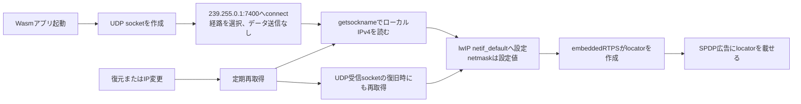

# Wasm mROS 2のIPv4動的取得と反映

この調査では、Wasm mROS 2アプリが起動時や別IPへの復元後に、自分のIPv4アドレスをどう決め直すかを追った。現行経路はWasm内でDHCPを行わず、UDPソケットが選んだローカルアドレスをlwIPのネットワーク設定に取り込む。run-06ではDockerの移行先IPへの更新を確認したが、同じ試験の完全な双方向通信条件は満たさなかった。したがって、この仕組みが確認できたのはローカルIPの再取得・反映までであり、移行後の通信全体の復旧ではない。対象はこのリポジトリのWAMR（WebAssembly Micro Runtime）、WASI socket拡張、lwIP（TCP/IP stack）、embeddedRTPSの経路であり、別ホストや複数NIC構成での挙動は評価していない。

## 全体像

ここでいう**locator**は、RTPS通信相手が使う宛先IPアドレスとUDP portの情報である。**participant**はRTPS上の参加者で、この実装では作成したmROS 2ノードに対応する。**SPDP**はparticipantの発見情報を広告する経路で、そのメッセージにlocatorが含まれる。

## 起動時の取得

代表的なアプリは`mros2::init()`より前に`netif_wasm_add(NETIF_IPADDR, NETIF_NETMASK)`を呼ぶ（[例](../../workspace/pub_twist/app.cpp)）。現在の[ヘッダー](../../include/netif.h)では`NETIF_IPADDR`は`NULL`で、互換性のために引数として残るだけである。実際のアドレスは[lwIP側の取得関数](../../lwip-wasm/src/netif/netif_wasm.c)が決める。

取得処理は次の順序で動く。

1. IPv4のUDPソケットを作る。
2. 組み込みのDDS discovery multicast宛先`239.255.0.1:7400`に`connect()`する。コードのコメントどおり、これは送信経路を選ぶためで、データグラムは送らない。POSIX仕様でも、データグラムsocketの`connect()`はpeerアドレスを設定し、未bindならローカルアドレスを割り当てる操作として記述されている。[The Open Group: `connect()`](https://pubs.opengroup.org/onlinepubs/009695399/functions/connect.html)
3. `getsockname()`でsocketのローカルアドレスを読み、IPv4で、かつ`0.0.0.0`でないことを確認する。[Linux man-pages: `getsockname()`](https://www.man7.org/linux/man-pages/man2/getsockname.2.html)
4. 取得したIPv4を`netif_default`のアドレスにし、mROS 2/embeddedRTPSから参照できるようにする。

ここでいう「動的取得」は、アプリがDHCPサーバーからleaseを受け取ることではない。`lwipopts.h`では`LWIP_DHCP`と、それに連動する`LWIP_AUTOIP`が無効である。アプリは実行環境側のsocket経路が選んだローカルIPv4を読み取る。一方、netmaskは動的に調べず、起動時は`NETIF_NETMASK`、復元後に`netif_default`を作り直す場合は`255.255.255.0`を使う。

## 復元後の更新とRTPSへの反映

SPDPのbroadcast workerは送信周期ごとに`netif_wasm_refresh()`を呼ぶ。関数は同じsocket probeを再実行し、IPが変わっていれば`netif_default`を更新する。WAMR restoreでnative側のglobal stateが初期化され、`netif_default`が`NULL`になった場合も、netifを作り直して変更通知を立てる。

変更を検出すると、`SPDPAgent::refreshLocalIp()`はparticipantのlocal unicast locatorを更新し、participant announcement bufferを作り直す。locatorを作る関数はlwIPの既定interface（`netif_default`）に入ったIPv4を参照する。次のSPDP announcementが、新しいIPをpeerへ知らせる経路になる。また、UDP multicast受信socketの復旧処理も`netif_wasm_refresh()`を呼び、新しいlocal IPでsocketを作り直してmulticast groupへ再参加する。

更新はIPアドレスの変化を検出した場合に行われる。netmaskはこのrefreshでは更新されない。probeに失敗するとrefreshはエラーを返し、SPDP側は失敗を記録して次の周期で再試行する。代表アプリの起動時呼び出しは戻り値を確認していないため、初回probe失敗時のアプリ全体の挙動は、ここで参照した記録からは分からない。

## run-06で確認できたこと

run-06は同一ホスト上のDocker containerを使った別IP復元試験である。移行元containerは`172.18.0.3`、移行先は`172.18.0.6`だった。復元ログには`netif_wasm: local ip changed to 0x060012ac`があり、同じrunのDocker inspect記録は移行先を`172.18.0.6`としている。レポートは両者が一致すると整理している。これは、復元後にsocket経由で取得したアドレスが移行先containerのIPへ更新された証拠である。

ただし、run-06の90秒ゲートで新しい完全往復IDは0件だった。Wasmからpeerへの送信とpeer側callbackは観測された一方、peerからWasmへの該当unicast DATAとWasm callbackは確認されなかった。従って「IPを取り直せた」ことを「別IP移行後のROS通信が復旧した」ことと同一視しない。試験結果と証拠境界は[run-06 report](2026-09-27/runs/run-06/report.md)、IP更新の生ログは[restore log](2026-09-27/runs/run-06/raw/wasm-restore.log)、移行先IPは[Docker inspect記録](2026-09-27/runs/run-06/raw/destination-container-inspect.json)を参照。

## 適用範囲と未確認点

- probe先のmulticast宛先はコード内で固定されている。複数interface、複数route、multicast routeがない環境でどのアドレスが選ばれるかは、この試験で確認していない。
- netmaskは`/24`相当の固定値であり、IPと同時には再取得しない。移行先subnetのmaskが異なる条件は未検証である。
- SPDP周期での再取得なので、network変更イベントに即時反応する設計ではない。周期の間隔や初回probe失敗時のアプリ動作も、対象ビルドの実行条件で個別確認が必要である。
- ルートの[README](../../README.md)には`include/netif.h`や`include/rtps/config.h`へIPを手動設定する案内が残る。一方、現行の[WASM用netif header](../../include/netif.h)はIP引数を互換用として扱う。READMEの案内が別のPOSIX build向けなのか、現行WASM buildにも適用するのかは、文書だけでは確定できない。

次の確認では、異なるsubnet/mask、複数NIC、multicast routeの有無を分けて試し、取得IP・netmask・広告locatorを別々に照合する必要がある。初回probeの失敗も入力条件として扱えば、起動時にIPが得られない場合の挙動を切り分けられる。
